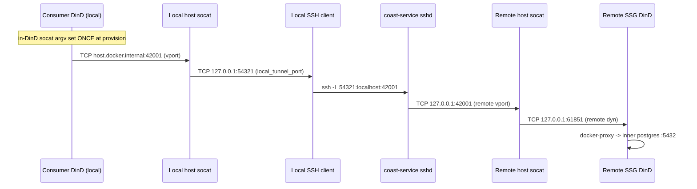
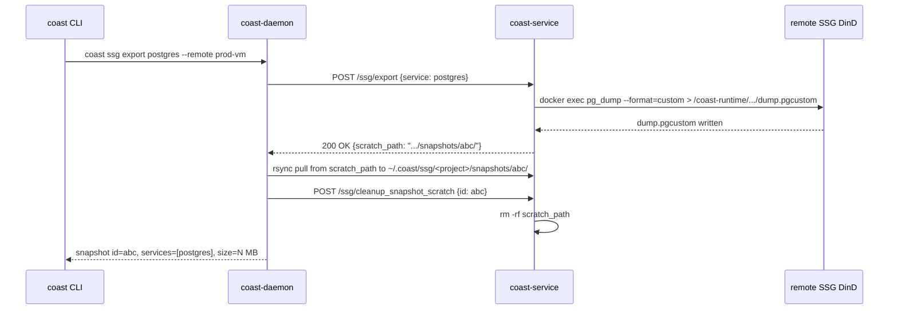
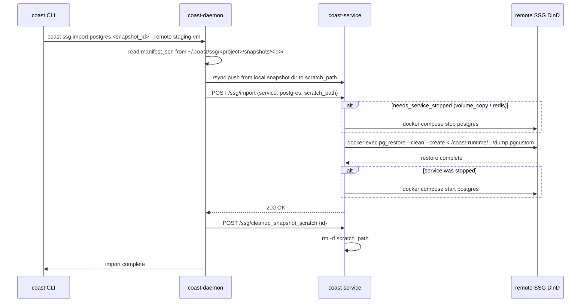

# Remote Shared Service Groups (Remote SSG) — Design Document

> Status: Pre-implementation. Companion to [`DESIGN.md`](./DESIGN.md), which
> captures the local-only SSG model end-to-end through Phase 33. This document
> extends that model with three new capabilities:
>
> 1. Per-`(project, remote)` SSGs running on `coast-service` so a project's
>    shared services can live on a beefier dev VM rather than the developer's
>    laptop.
> 2. A runtime "pointer" abstraction (`coast ssg point`) that lets consumer
>    coasts switch SSG location without rebuilds.
> 3. A built-in importer / exporter framework (`coast ssg export`,
>    `coast ssg import`, `coast ssg transfer`) for moving SSG volume data
>    between hosts (`pg_dump`, `redis dump.rdb`, `cp -R`, etc.).
>
> Read [`DESIGN.md`](./DESIGN.md) §23 (per-project SSG correction) and §24
> (host virtual ports) before this file. Both are baseline. Any claim here
> that contradicts §23 or §24 is a bug in this document and must be
> reconciled before implementation.
>
> Implementation companion for `coast-service`: [`../coast-service/REMOTE_SSG_SERVICE_DESIGN.md`](../coast-service/REMOTE_SSG_SERVICE_DESIGN.md).
> That file is the coast-service-side cut of this design: HTTP surface,
> state schema, filesystem layout, reconciliation. New SSG work for
> `coast-service` is captured there, not here.

## Ground rules (read before writing code)

These extend [`DESIGN.md`](./DESIGN.md)'s Ground Rules and apply to every
Remote SSG PR:

1. **Use the make targets, not bare cargo.** Same as `DESIGN.md`. `make
   check` is the commit gate. `make test` and `make lint` are the
   canonical test and lint entrypoints.
2. **Never suppress clippy issues.** Same posture as the local SSG. No
   `#[allow(...)]`, no `--allow` flags, no inline `#[expect(...)]`
   shortcuts on new code. The phase exit criterion in `DESIGN.md §21.4`
   stays in force.
3. **`coast-service` does NOT depend on `coast-ssg`.** The
   [`DESIGN.md §4.1`](./DESIGN.md) layering rule is preserved. Bringing
   remote SSGs into scope (overturning `DESIGN.md §17-6` / `§20.7`)
   does NOT require collapsing the layering — the truly shared pieces
   are lifted into lower crates (`coast-docker`, `coast-core`) and
   consumed by both sides. Concretely:
   - `host_socat` supervisor moves from `coast-daemon` to
     `coast-docker` (it's a Docker-network primitive, not specific to
     SSGs — same posture as Phase 18's lift of `shared_service_routing`).
   - `compose_synth` (pure compose-yaml builder) moves from
     `coast-ssg` to `coast-docker`.
   - `SsgManifest` and adjacent manifest types move from
     `coast-ssg::build::artifact` to `coast-core` (they are already
     protocol-adjacent — the daemon-side `manifest.json` reader and
     the coast-service-side writer round-trip the same shape).
   - `coast-service/src/ssg/` is the coast-service-side
     implementation: HTTP handlers, mirror state tables, a leaner
     lifecycle orchestrator that consumes the lifted primitives from
     `coast-docker` and `coast-core` directly. It is NOT a thin
     re-export of `coast-ssg::runtime::*`.

   Reviewers MUST reject PRs that smuggle a `coast-ssg` dependency
   into `coast-service` (directly or transitively). When you find
   yourself wanting to share orchestration code between the two
   sides, lift the primitive into `coast-docker` or `coast-core`
   instead.
4. **Plan deviations MUST be reflected in this design doc.** Same posture
   as `DESIGN.md` Ground Rule #5 — disposable plan files must update
   this file in the same PR. If implementation diverges, capture the
   "why" in `§23 Open questions` (marked SETTLED) or `§24 Risks` as
   appropriate.
5. **§23 + §24 invariants are load-bearing.** This design's correctness
   rests on (a) one SSG per project (`DESIGN.md §23`) and (b) consumer
   in-DinD socats target a stable virtual port keyed by `(project,
   service_name, container_port)` (`DESIGN.md §24`). PRs that violate
   either invariant block merge.
6. **Remote SSGs are opt-in, per project.** A project that does not
   declare `[ssg] remote = "..."` and has not run `coast ssg point
   <remote>` keeps the local-only behavior bit-for-bit. Zero-impact
   migration is a hard requirement.

## Table of contents

- [§0 Implementation progress](#0-implementation-progress)
- [§1 Problem](#1-problem)
- [§2 Terminology](#2-terminology)
- [§3 Goals and non-goals](#3-goals-and-non-goals)
- [§4 High-level architecture](#4-high-level-architecture)
- [§5 SSG Coastfile changes](#5-ssg-coastfile-changes)
- [§6 Pointer state](#6-pointer-state)
- [§7 CLI surface](#7-cli-surface)
- [§8 Protocol additions](#8-protocol-additions)
- [§9 Daemon state](#9-daemon-state)
- [§10 coast-service additions](#10-coast-service-additions)
- [§11 Routing — local consumer to remote SSG](#11-routing--local-consumer-to-remote-ssg)
- [§12 Routing — remote consumer to remote SSG](#12-routing--remote-consumer-to-remote-ssg)
- [§13 Build flow](#13-build-flow)
- [§13.5 Streaming verb parity (`coast ssg exec` / `coast ssg logs`)](#135-streaming-verb-parity-coast-ssg-exec--coast-ssg-logs)
- [§14 Lifecycle: run / stop / start / restart / rm](#14-lifecycle-run--stop--start--restart--rm)
- [§15 Importers and exporters](#15-importers-and-exporters)
- [§16 Remote import / export + `coast ssg transfer`](#16-remote-import--export--coast-ssg-transfer)
- [§17 Auto-start semantics](#17-auto-start-semantics)
- [§18 Doctor and observability](#18-doctor-and-observability)
- [§19 Failure modes](#19-failure-modes)
- [§20 Security](#20-security)
- [§21 File organization](#21-file-organization)
- [§22 Phased rollout](#22-phased-rollout)
- [§23 Open questions](#23-open-questions)
- [§24 Risks](#24-risks)
- [§25 Success criteria](#25-success-criteria)
- [§26 Terminology cheat sheet](#26-terminology-cheat-sheet)
- [§27 Development approach for Remote SSG](#27-development-approach-for-remote-ssg)

---

## 0. Implementation progress

Living checklist. Every PR that advances a phase MUST tick the boxes it
closes in the same commit. Single source of truth for project status —
[`../coast-service/REMOTE_SSG_SERVICE_DESIGN.md`](../coast-service/REMOTE_SSG_SERVICE_DESIGN.md)
references this tracker rather than duplicating it.

Legend: `[ ]` not started, `[~]` in progress, `[x]` done.

### Phase R-0 — Design + scaffolding

- [ ] [`coast-ssg/REMOTE_DESIGN.md`](./REMOTE_DESIGN.md) landed
- [ ] [`coast-service/REMOTE_SSG_SERVICE_DESIGN.md`](../coast-service/REMOTE_SSG_SERVICE_DESIGN.md) landed
- [ ] [`coast-ssg/DESIGN.md`](./DESIGN.md) banners landed (top + §34)
- [ ] [`coast-service/REMOTE_SPEC.md`](../coast-service/REMOTE_SPEC.md) banner landed
- [ ] [`docs/shared_service_groups/README.md`](../docs/shared_service_groups/README.md) Reference table updated
- [ ] Empty `coast-service/src/ssg/mod.rs` module skeleton (no use yet — declares the home for the R-2+ work without dragging in `coast-ssg`)

**Tests** (see §27 for normative test conventions):

- No new integration tests in this phase (doc-only).
- `cargo build --workspace` green.
- `make lint` clean (zero clippy suppressions added — see §27.4).

### Phase R-0.5 — Lift shared primitives into lower crates

Pre-requisite for the rest. Done in isolation so the `coast-ssg → coast-daemon`
delivery path stays green throughout. Each lift is a no-behavior-change
move + rename, with the daemon's existing call sites flipped to the new
home in the same commit. See Ground Rule #3.

- [ ] `host_socat` supervisor moves from
      [`coast-daemon/src/handlers/ssg/host_socat.rs`](../coast-daemon/src/handlers/ssg/host_socat.rs)
      to `coast-docker/src/host_socat.rs`. Daemon call sites flipped to the
      new path. `coast-service` will consume the same module from R-3 onwards.
- [ ] `compose_synth` moves from
      [`coast-ssg/src/runtime/compose_synth.rs`](./src/runtime/compose_synth.rs)
      to `coast-docker/src/ssg_compose_synth.rs` (rename guards against
      future name collision; the function itself is pure-yaml synthesis).
      `coast-ssg::runtime::compose_synth` becomes a thin re-export for
      backwards-compat within the daemon path.
- [ ] `SsgManifest` and adjacent manifest types
      ([`SsgManifestService`, `SsgManifestSecretInject`,
      `SsgManifestSecret`](./src/build/artifact.rs)) move from
      `coast-ssg::build::artifact` to `coast-core::artifact::ssg`.
      Re-exported from the original location so existing imports keep
      compiling.
- [ ] **`ssg_transfer` registry home decided up-front:** the
      `SnapshotExporter` / `SnapshotImporter` trait + 6 builtins
      land at `coast-docker/src/ssg_transfer/` in R-1 (NOT
      `coast-ssg/src/transfer/`). Reason: both daemon-side and
      coast-service-side need it, and the §4.1 layering rule
      forbids `coast-service → coast-ssg`. Documented in §15.1.
- [ ] `cargo build --workspace`, `cargo test --workspace`, and
      `cargo clippy --workspace -- -D warnings` all green after each
      lift in isolation. No new behavior, just re-homing.

**Tests**:

- No new integration tests (lifts are no-behavior-change moves).
- All existing `test_ssg_*.sh` tests in
  [`integrated-examples/`](../integrated-examples/) MUST still pass
  after the lifts via `make run-dind-integration TEST=<name>`.
- `make test` green; `make lint` clean (zero clippy suppressions).

### Phase R-1 — Importer / exporter framework + local SSG path

The `SnapshotExporter` / `SnapshotImporter` trait shape is
location-agnostic: it operates on a `&dyn SsgDockerOps` against
whatever DinD container is local to the caller. R-1 ships the
framework itself plus the local-SSG path (i.e. the daemon
instantiating the trait against its own bollard handle); the
remote-SSG path lights up in R-6 once R-3's coast-service-side
HTTP plumbing exists. Both sides re-use the same trait shape
against their respective DinD; no fork.

- [ ] `coast-docker/src/ssg_transfer/` module + registry (`SnapshotExporter`, `SnapshotImporter` traits — location-agnostic by construction; lifted there in R-0.5 so coast-service can consume without violating the §4.1 layering rule)
- [ ] Six built-in `kind`s: `postgres`, `mysql`, `mongodb`, `redis`, `volume_copy`, `command`
- [ ] `[shared_services.<svc>.export]` / `[shared_services.<svc>.import]` parser additions in `coast-ssg/src/coastfile/`
- [ ] `SsgAction::{Export, Import, SnapshotLs, SnapshotShow, SnapshotRm}` protocol verbs
- [ ] `coast ssg export` / `import` / `snapshot {ls,show,rm}` CLI verbs (operate on the local SSG; `--remote` flag added in R-6 to drive pull/push against remote SSGs)
- [ ] Snapshots at `~/.coast/ssg/<project>/snapshots/<id>/` with `manifest.json` + per-service blobs (the canonical store; remote operations also land bytes here per §16)

**Tests** (registered in [`dindind/integration.yaml`](../dindind/integration.yaml)):

- [ ] `test_ssg_export_import_postgres` — `pg_dump` round-trip against a local SSG, table data preserved across import.
- [ ] `test_ssg_export_import_mysql` — `mysqldump --single-transaction` round-trip.
- [ ] `test_ssg_export_import_mongodb` — `mongodump --archive --gzip` round-trip.
- [ ] `test_ssg_export_import_redis` — `BGSAVE` + dump.rdb swap; key data preserved.
- [ ] `test_ssg_export_import_volume_copy` — tar / untar round-trip with service stop / restart bracketing.
- [ ] `test_ssg_export_import_command` — user-supplied argv kind via `kind = "command"`; smoke + failure-mode coverage.
- Test fixtures live under `integrated-examples/projects/coast-ssg-export-*/`.

### Phase R-2 — Coastfile `remote` field + remote build

- [ ] `[ssg].remote = "..."` parsed; `HostBindMount` volume entries rejected when set
- [ ] `coast ssg build --remote <name>` CLI flag; resolution order: flag > Coastfile > none
- [ ] Build forwards to `coast-service` over the SSH tunnel
- [ ] `coast-service` writes artifacts to `$COAST_SERVICE_HOME/ssg/<project>/builds/<id>/`
- [ ] Manifest snapshot mirrored locally for `coast ssg ps` / `ls` UX
- [ ] Lifecycle still local-only (build only this phase)

**Tests**:

- [ ] `test_remote_ssg_build_basic` — happy path: `coast ssg build --remote <name>` lands a build artifact at `$COAST_SERVICE_HOME/ssg/<project>/builds/<id>/`; daemon-side manifest snapshot present.
- [ ] `test_remote_ssg_build_unknown_remote_errors` — `--remote` value not in `coast remote ls`: hard-error before any rsync, clear message.
- [ ] `test_remote_ssg_build_rejects_host_bind_mount` — `[ssg].remote` set + `HostBindMount` volume entry: parse-time rejection.
- Fixtures: `integrated-examples/projects/coast-remote-ssg-build/`.

### Phase R-3 — Lifecycle forwarding (run / stop / start / restart / rm)

- [ ] `coast-service/src/handlers/ssg.rs` HTTP routes (thin handler layer)
- [ ] `coast-service/src/ssg/{lifecycle,state,paths}.rs` — coast-service-local
      lifecycle implementation built on the R-0.5 lifted primitives (no
      `coast-ssg` dep)
- [ ] coast-service grows `ssg`, `ssg_services`, `ssg_virtual_ports` tables
- [ ] Daemon `ssg.remote_name` shadow column
- [ ] Daemon `coast ssg run/stop/start/restart/rm` forwards when `remote_name IS NOT NULL`
- [ ] `coast ssg ps` / `ls` show LOCATION column
- [ ] `/ssg/exec` and `/ssg/logs` reach feature parity with the local
      verbs per §13.5 (TTY, bidirectional streams, signal forwarding,
      `--service`, `--follow`/`--tail`, cancellation cleanup)
- [ ] CLI surface for `coast ssg exec` / `coast ssg logs` is
      location-agnostic (no `--remote` flag added; pointer
      resolution is invisible)
- [ ] Consumer routing through remote still hard-errors (waits for R-4)

**Tests**:

- [ ] `test_remote_ssg_lifecycle` — `coast ssg run/stop/start/restart/rm` round-trip against a remote SSG; state survives daemon restart.
- [ ] `test_remote_ssg_rm_cleanup` — `coast ssg rm --with-data` removes container, inner named volumes, build artifacts; no orphans on coast-service.
- [ ] `test_remote_ssg_two_projects_one_remote` — two projects each get their own `{project}-ssg` on the same coast-server; state isolation verified.
- [ ] `test_remote_ssg_exec_parity` — `coast ssg exec --tty -- bash`, signal forwarding (Ctrl-C → SIGINT), stdin/out/err bidirectional, `--service <name>` targeting; behavior byte-identical to local SSG.
- [ ] `test_remote_ssg_logs_parity` — `coast ssg logs --follow --tail 100 --service postgres`, real-time chunk streaming, clean cancellation on local CLI close; behavior byte-identical to local SSG.
- Fixtures: `integrated-examples/projects/coast-remote-ssg-multi/`.

### Phase R-3.5 — Pointer infra (local-only values)

- [ ] `ssg_pointers` table on the daemon
- [ ] `SsgAction::{Point, Unpoint, ShowPointer}` protocol verbs
- [ ] `coast ssg point` / `unpoint` / `pointer` CLI
- [ ] Pointer values constrained to `"local"` until R-4 lights up remote routing
- [ ] `coast ssg ls` / `ps` surface pointer status

**Tests**:

- [ ] `test_ssg_pointer_local_idempotent` — `coast ssg point local` twice in a row is a no-op; pointer row persists across daemon restart; `coast ssg unpoint` clears it.
- Fixtures: extends existing `integrated-examples/projects/coast-ssg-*`.

### Phase R-4 — Consumer routing through remote SSG

- [ ] `ssg_remote_tunnels` table + `ssh -L` lifecycle
- [ ] `host_socat::spawn_or_update` accepts both local and tunneled upstreams
- [ ] `synthesize_shared_service_configs` consults the pointer
- [ ] Pointer accepts any registered remote name
- [ ] Daemon-restart recovery respawns `ssh -L` from `ssg_remote_tunnels`
- [ ] `coast ssg point <remote>` repoints live consumers via host-socat argv swap

**Tests**:

- [ ] `test_ssg_pointer_repoints_live_consumer` — running consumer DinD; `coast ssg point <remote>` swaps host-socat upstream; consumer's existing TCP connections RST and reconnect; consumer-side argv unchanged.
- [ ] `test_remote_ssg_consumer_basic` — local consumer `coast run` with pointer → remote SSG; app dials `postgres:5432`, lands at remote SSG postgres; data round-trip.
- [ ] `test_ssg_pointer_unreachable_remote_errors` — pointer references a remote whose coast-service is down; `coast run` hard-errors with remediation message; no consumer DinD started.
- [ ] `test_remote_ssg_daemon_restart_restores_tunnels` — daemon restart with R-4 tunnels live; `ssg_remote_tunnels` rows replayed; consumer connections survive (modulo brief TCP RST during respawn).
- Fixtures: `integrated-examples/projects/coast-remote-ssg-consumer/`.

### Phase R-5 — Remote-consumer to remote-SSG routing

The daemon is the orchestrator, not the data-plane rendezvous. At
consumer provision time the daemon resolves `(consumer location, SSG
location)` and configures the consumer-side coast-service's host
socat with the appropriate upstream:

- **Consumer and SSG on the same coast-server:** host socat upstream
  is `127.0.0.1:<ssg_dyn>`. No SSH, no inter-VM hop — entirely on one
  coast-server.
- **Consumer and SSG on different coast-servers:** host socat upstream
  is `<ssg_coast_server_hostname>:<vport>`. Direct TCP between
  coast-servers; the daemon is not in the data path.
- **Cross-server reachability is a deployment requirement** (Goal #7).
  Coast-servers must be on a shared subnet / VPC / Tailscale mesh.
  No daemon-rendezvous fallback exists in v1; misconfiguration
  surfaces as a clear preflight error.

Checklist:

- [ ] Routing decision in
      `coast-daemon/src/handlers/ssg/routing_resolver.rs` (NEW):
      input `(consumer_loc, ssg_loc)`; output a
      `HostSocatUpstream` enum with two variants
      (`Loopback { dyn_port }`, `DirectTcp { host, port }`)
- [ ] `coast-service`'s `host_socat` upstream made
      configurable per-`(project, service)` via persisted
      `ssg_socat_upstreams.upstream_addr` (string form:
      `"127.0.0.1:<dyn>"` or `"<host>:<port>"`)
- [ ] Daemon's `setup_shared_service_tunnels` learns the
      smart-routing branch — for §12.1 and §12.2 it spawns no SSH
      tunnel; only R-4 (local consumer ↔ remote SSG) and Phase 30
      (remote consumer ↔ local SSG) keep their SSH tunnels.
- [ ] Same-coast-server short-circuit verified end-to-end in
      `test_remote_ssg_consumer_remote_ssg_same_coast_server`
- [ ] Different-coast-server direct-TCP verified in
      `test_remote_ssg_consumer_remote_ssg_cross_coast_server`
- [ ] `restore_ssg_shared_tunnels` is location-aware: rebuilds
      direct-TCP host_socat upstreams from `ssg_socat_upstreams`,
      respawns `ssh -R/-L` only for the R-4 / Phase 30 paths
- [ ] Failure mode: cross-server upstream unreachable surfaces a
      clear preflight error (TCP probe at provision time, not a
      silent hang). Error message points the user at the
      same-subnet deployment requirement.

**Tests**:

- [ ] `test_remote_ssg_consumer_remote_ssg_same_coast_server` — consumer and SSG both on coast-server-A; routing variant `remote_same`; no `ssh -L` spawned; data round-trip via single host socat.
- [ ] `test_remote_ssg_consumer_remote_ssg_cross_coast_server` — consumer on coast-server-A, SSG on coast-server-B; routing variant `remote_direct`; coast-server-A's host socat forwards directly to `coast-server-B:<vport>`; daemon NOT in the data path; verified by `coast ssg ports` showing the upstream addr and by `tcpdump`-style assertion that no packets transit the daemon during steady-state traffic.
- [ ] `test_remote_ssg_cross_server_unreachable_preflight_error` — coast-server-B firewall drops `<vport>`; daemon's preflight TCP probe fails; consumer `coast run` hard-errors with the same-subnet remediation message before any DinD starts.
- Fixtures: `integrated-examples/projects/coast-remote-ssg-cross-server/`.

### Phase R-6 — Remote import / export + `coast ssg transfer` (bidirectional)

R-1 shipped the location-agnostic framework + local-SSG path.
R-3 stood up the coast-service-side HTTP plumbing (`/ssg/export`,
`/ssg/import`). R-6 wires the two together so both **pull**
(remote→local) and **push** (local→remote) flow through the same
canonical snapshot store on the daemon. `coast ssg transfer` is
sugar over export+import that lets the user collapse the round-trip
into one command.

**Pull (remote → local) — covered by `coast ssg export <svc> --remote <name>`**:

- [ ] `coast ssg export --remote <name>` flag added; resolution: flag > pointer > Coastfile.
- [ ] Daemon forwards `POST /ssg/export` to coast-service over the SSH tunnel.
- [ ] coast-service runs the exporter against its local DinD, writes blob to `$COAST_SERVICE_HOME/ssg/<project>/runs/<project>/snapshots/<id>/`.
- [ ] Daemon rsyncs the blob to `~/.coast/ssg/<project>/snapshots/<id>/` (canonical store).
- [ ] coast-service wipes its scratch dir on success.

**Push (local → remote) — covered by `coast ssg import <svc> <snapshot> --remote <name>`**:

- [ ] `coast ssg import --remote <name>` flag added; resolution same as above.
- [ ] Daemon rsyncs the local snapshot bundle from `~/.coast/ssg/<project>/snapshots/<id>/` to coast-service's scratch dir.
- [ ] Daemon forwards `POST /ssg/import` to coast-service.
- [ ] coast-service runs the importer (with `needs_service_stopped` honored) against its local DinD.
- [ ] coast-service wipes its scratch dir on success or failure.

**Transfer (sugar over push + pull)**:

- [ ] `coast ssg transfer <svc> --from <loc> --to <loc>` collapses an
      export at `<from>` + import at `<to>` into one verb.
- [ ] Same-location transfer (`--from local --to local`) is allowed; produces
      a backup snapshot at the canonical store.
- [ ] Cross-location transfer keeps the intermediate snapshot by default (`--no-keep` to delete on success).
- [ ] `--all` variant transfers every service that has both `[export]` and
      `[import]` blocks; per-service kind mismatch is a hard error before any I/O.

**Snapshot store invariants**:

- [ ] The canonical snapshot store is ALWAYS the daemon side
      (`~/.coast/ssg/<project>/snapshots/<id>/`), regardless of which
      direction the transfer flowed.
- [ ] coast-service's `runs/<project>/snapshots/<id>/` is transient
      scratch only; reaped after each operation by `coast remote prune`
      and at end-of-op.

**Tests** (all under `integrated-examples/test_remote_ssg_*.sh`):

- [ ] `test_remote_ssg_pull_export_postgres` — pull path: data on remote SSG, `coast ssg export postgres --remote prod-vm`, blob lands locally, content verified.
- [ ] `test_remote_ssg_pull_export_volume_copy` — pull path with the service-stop-required kind; remote SSG service stopped during export, restarted after.
- [ ] `test_remote_ssg_push_import_postgres` — push path: blob on daemon, `coast ssg import postgres <snapshot> --remote staging-vm`, data lands on remote SSG.
- [ ] `test_remote_ssg_push_import_volume_copy` — push path for cross-arch detection: amd64-source `volume_copy` blob → arm64 target hard-errors; same-arch path succeeds.
- [ ] `test_remote_ssg_transfer_local_to_remote` — `coast ssg transfer postgres --from local --to staging-vm`; data round-trips local → remote in one command.
- [ ] `test_remote_ssg_transfer_remote_to_local` — `coast ssg transfer postgres --from prod-vm --to local`; data round-trips remote → local.
- [ ] `test_remote_ssg_transfer_remote_to_remote` — `coast ssg transfer postgres --from prod-vm --to staging-vm`; via daemon (canonical store as intermediate), no direct coast-service-to-coast-service traffic.
- [ ] `test_remote_ssg_export_all_remote` — `coast ssg export --all --remote prod-vm` produces a multi-service bundle in one snapshot dir.
- [ ] `test_remote_ssg_kind_mismatch_errors` — `coast ssg transfer --all` with one service whose source kind doesn't match target import kind: hard-error before any I/O.
- Fixtures: `integrated-examples/projects/coast-remote-ssg-transfer-{push,pull,both}/`.

### Phase R-7 — Docs + polish

- [ ] `docs/shared_service_groups/REMOTE.md` MUST prominently
      document the subnet-peering deployment requirement (Goal #7)
      — top-of-page banner + a "Network requirements" section
      placed before any setup walkthrough. POINTER.md and
      IMPORT_EXPORT.md cross-link back to this section rather than
      re-explaining.
- [ ] `docs/shared_service_groups/REMOTE.md`
- [ ] `docs/shared_service_groups/IMPORT_EXPORT.md` (covers both
      directions: pull/push/transfer, with concrete walkthroughs
      for each)
- [ ] `docs/shared_service_groups/POINTER.md`
- [ ] `docs/shared_service_groups/CLI.md` and `README.md` updated
- [ ] `coast ssg doctor` extended with remote findings (orphan pointer, missing remote build, unreachable cross-server upstream)

**Tests**:

- No new integration tests in this phase (doc + polish only).
- Existing R-1 through R-6 tests MUST all still pass via
  `make run-dind-integration TEST=all`. Doc-only PRs that break a
  dindind test are bounced; the doc landing is the forcing function
  for one final regression sweep.
- `coast ssg doctor` regression: extend
  `test_ssg_doctor_*` (existing local-SSG suite) with a remote
  variant `test_remote_ssg_doctor` covering the new findings.

---

## 1. Problem

[`DESIGN.md §1`](./DESIGN.md) enumerates the original SSG motivations
(host port collisions across projects, Docker Desktop sprawl,
`auto_create_db` project-bound). §23 corrected the cross-project sharing
assumption. Everything below presupposes those corrections.

This design adds three orthogonal capabilities the local-only SSG can't
deliver:

1. **Run an SSG on a different machine.** A developer working on a thin
   client (low-spec laptop, ARM Mac) wants to host postgres / redis on a
   beefier shared dev VM. Today they have two choices: run the services
   on the laptop (slow), or set up something hand-rolled with `ssh -L`
   and a manually managed compose stack (fragile). Coast already runs
   *coasts* remotely
   ([`coast-service/REMOTE_SPEC.md`](../coast-service/REMOTE_SPEC.md)).
   Extending that to SSGs closes the loop.
2. **Switch a project's SSG location at runtime.** A developer wants to
   point at staging's data while debugging a production-only bug, then
   flip back to local without rebuilding the SSG, the consumer coasts,
   or anything else.
3. **Move SSG volume data between hosts.** Pulling production data down
   to a local SSG for repro work; seeding a fresh staging SSG from
   local; in general, treating the SSG's data dir as something you can
   `pg_dump` / `pg_restore` between locations without manual `docker
   cp` gymnastics.

These three are independent but compose: the pointer is what ties
location switching to consumer routing; the importer/exporter is what
makes the location switch valuable beyond connectivity (you almost
always want to move data with the location change).

## 2. Terminology

Extends [`DESIGN.md §2`](./DESIGN.md) and [`§22`](./DESIGN.md)'s cheat
sheet (as corrected by §23).

| Term | Meaning |
|---|---|
| **Remote SSG** | An SSG owned by `coast-service` on a registered remote. One per `(project, remote)` pair. |
| **Local SSG** | An SSG owned by `coast-daemon` (the original §23 model). Identified by location string `"local"`. |
| **SSG location** | A string that resolves to either `"local"` or a registered remote name. The unit of "where does this project's SSG actually live." |
| **Pointer** | A daemon-side runtime override (`ssg_pointers` table) that decides which location a project's consumer coasts route to. Takes precedence over the Coastfile default. |
| **Active location** | Result of resolving the pointer. What consumer routing actually consults. |
| **Snapshot** | A bundle produced by `coast ssg export`, consumable by `coast ssg import`. Contains a `manifest.json` plus tool-native dump bytes (e.g. `pg_dump` custom format). Lives at `~/.coast/ssg/<project>/snapshots/<id>/`. |
| **Importer / Exporter** | A registered Rust impl of the `SnapshotImporter` / `SnapshotExporter` trait (`coast-ssg/src/transfer/`). Six built-in `kind`s ship in v1. |
| **Kind** | A registered importer/exporter name. Six built-in: `postgres`, `mysql`, `mongodb`, `redis`, `volume_copy`, `command`. |
| **Transfer** | The combined export + import operation. `coast ssg transfer <svc> --from <loc> --to <loc>`. |
| **Local tunnel port** | Daemon-allocated dynamic port that's the local end of `ssh -L <local_tunnel_port>:localhost:<remote_virtual_port>`. The host socat's upstream when the active location is remote. |
| **Coast-server** | A registered remote running `coast-service`, capable of hosting one or more remote SSGs. |

## 3. Goals and non-goals

### Goals

1. **One SSG per `(project, remote)` pair.** Multiple projects on one
   `coast-server` are fine; two SSGs for the same project on the same
   `coast-server` are not.
2. **Existing local SSG flow is unchanged when no remote is involved.**
   Zero-impact migration. Users who never declare `remote` and never
   run `coast ssg point` see no behavioral change.
3. **Consumer coasts route transparently** to whichever SSG location
   their project resolves to. The §24 host virtual port abstraction is
   what makes this possible — consumer in-DinD socat argv is set ONCE
   at provision and never changes regardless of where the upstream
   actually lives.
4. **Live repointing without consumer rebuild.** `coast ssg point local`
   → `coast ssg point staging-vm` is one host-socat argv swap per
   service plus one `ssh -L` setup. Consumer DinDs are never touched.
5. **First-class bidirectional import/export between any two
   locations.** First-class importers and exporters for postgres,
   mysql, mongodb, redis, plus a generic `volume_copy` kind for
   anything else, plus a `command` escape hatch for custom needs.
   The trait is location-agnostic (§15.1) and the framework supports
   all four flows symmetrically: **pull** (remote → local),
   **push** (local → remote), **transfer** (any → any, daemon as
   intermediate canonical store), and same-location backup. There
   is no "you can only export from local SSGs" carve-out — every
   exporter / importer works on either side. See §16.
6. **Builds happen at the location they'll execute.** Mirrors the
   `coast build --type remote` pattern in `REMOTE_SPEC.md`.
7. **Daemon orchestrates, coast-servers carry data.** Cross-coast-server
   SSG access uses a direct TCP connection between coast-servers
   on the SSG's `<vport>`. The daemon's role is pure orchestration
   — it tells each coast-service what to bind and what upstream to
   forward to, then disengages from the data plane.
   Same-coast-server access is fully local on that one VM. See §12
   for the routing decision matrix.

   **Deployment requirement:** all coast-servers a developer
   registers must be on a network where they can reach each other
   on arbitrary TCP ports (typically a shared subnet, VPC, peered
   subnets, or a Tailscale/WireGuard mesh). This is the v1
   assumption. v2 may add a daemon-rendezvous fallback for
   non-peered topologies; not in scope here.

### Non-goals for v1

1. **Multiple SSGs for the same project on the same remote.** Out by
   construction (§23 invariant: one SSG per project; we extend that to
   per `(project, remote)` to allow location switching, but never two
   on one remote).
2. **Snapshot encryption at rest.** Snapshots live in
   `~/.coast/ssg/<project>/snapshots/` in plaintext (modulo whatever
   the dump tool produces — `pg_dump` custom format isn't encrypted).
   Document loudly. Defer to R-7 or a follow-up.
3. **Live data replication between SSGs.** No CDC, no streaming. The
   model is dump → transfer → restore. Always at-rest, always
   whole-snapshot.
4. **Cross-arch `volume_copy`.** Postgres data dirs are
   page-format-specific; moving a `volume_copy` snapshot from amd64 to
   arm64 corrupts it. Hard-error on cross-arch `volume_copy` import;
   the db-aware kinds are arch-agnostic via their dump formats and
   work cross-arch fine.
5. **Out-of-tree importer / exporter plug-ins.** v1 ships six built-ins
   plus the `command` kind. If we get demand for proper plug-ins,
   follow the `coast_secrets::extractor` pattern in a future revision.
6. **Auto-discovery of SSGs on a remote.** `coast remote add` registers
   a remote; the user is then responsible for running `coast ssg build
   --remote <name>` per project. We don't introspect the remote's
   existing state and offer to claim it.
7. **NAT traversal between unpeered coast-servers.** Cross-coast-server
   routing assumes coast-servers can reach each other over TCP on the
   SSG's `<vport>`. We do not build a NAT-traversal layer, a
   coast-service-to-coast-service authenticated tunnel, or a
   daemon-rendezvous fallback for v1. The deployment requirement
   in Goal #7 is sufficient for typical dev-cluster setups (shared
   subnet / VPC / Tailscale). Topologies that violate it are not
   supported in v1.

## 4. High-level architecture

```text
LOCAL                                       REMOTE (coast-server)
+------------------------------+            +-------------------------------------------+
| coast-daemon                 |   SSH RPC  | coast-service (:31420)                    |
|  state.db                    |<==========>|   state.db (per-project ssg / services /  |
|    ssg(remote_name=NULL|...) |            |              virtual_ports / ...)         |
|    ssg_pointers              |            |                                           |
|    ssg_remote_tunnels        |            |   +--------------------------+            |
|                              |            |   | {project}-ssg DinD       |            |
|  pointer resolves to:        |            |   |  inner postgres/redis/...|            |
|    "local" or <remote>       |            |   |  published on dyn ports  |            |
|                              |            |   +--------------------------+            |
|  host socat (per-service)    |            |   remote host socat (per-service)         |
|   LISTEN  : <virtual_port>   |            |    LISTEN  : <remote_virtual_port>        |
|   UPSTREAM: dyn (local) /    |            |    UPSTREAM: 127.0.0.1:<remote_dyn>       |
|             via ssh -L (rem) |            |                                           |
|                              |  ssh -L    |                                           |
|                              |<==========>| (sshd; GatewayPorts clientspecified)      |
|                              |            |                                           |
|  consumer DinD's in-DinD     |            |                                           |
|  socat -> host.docker.       |            |                                           |
|    internal:<virtual_port>   |            |                                           |
+------------------------------+            +-------------------------------------------+
```

Two key invariants from `DESIGN.md` carry forward unchanged:

- **§24 host virtual port** is keyed by `(project, service_name,
  container_port)` and is what every consumer socat targets. It does
  NOT encode location. Switching location only changes what's on the
  **other end** of the host socat.
- **Phase 30 symmetric `ssh -R`** for remote consumers continues to use
  the virtual port on both legs. The local end terminates at the
  (local) host socat. From the local host socat's perspective, "where
  is the SSG" is the same question regardless of where the consumer
  is.

The only new hop is the optional **`ssh -L` between the local host socat
and the remote host socat** when the active location is a remote.

```mermaid
flowchart LR
    subgraph localConsumer [Local consumer DinD]
        app[app container]
        consumerSocat["in-DinD socat\n(immutable argv)"]
    end
    subgraph localDaemon [Local daemon host]
        hostSocat["host socat\n(daemon-managed)"]
        sshL["ssh -L"]
    end
    subgraph remoteVm [coast-server]
        sshd[sshd]
        remoteHostSocat["remote host socat\n(coast-service-managed)"]
        ssgDind["{project}-ssg DinD"]
        innerPg[inner postgres]
    end
    app -->|"DNS: postgres -> alias"| consumerSocat
    consumerSocat -->|"host.docker.internal:vport"| hostSocat
    hostSocat -->|"127.0.0.1:local_tunnel_port"| sshL
    sshL -->|"ssh -L"| sshd
    sshd -->|"127.0.0.1:remote_vport"| remoteHostSocat
    remoteHostSocat -->|"127.0.0.1:remote_dyn"| ssgDind
    ssgDind --> innerPg
```



When the active location is `local`, `sshL` and the entire
`coast-server` column drop out — the host socat's upstream becomes
`127.0.0.1:<local_ssg_dyn_port>` exactly as in `DESIGN.md §24.3`.

### 4.1 What changes vs. local SSG

| Aspect | Local SSG | Remote SSG |
|---|---|---|
| Container host | host Docker daemon | coast-server's Docker daemon |
| State of record | daemon `state.db` | coast-service `state.db`, plus a daemon-side shadow row |
| Build artifact | `~/.coast/ssg/<project>/builds/<id>/` | `$COAST_SERVICE_HOME/ssg/<project>/builds/<id>/` (canonical) + manifest snapshot on daemon for UX |
| Snapshot canonical store | `~/.coast/ssg/<project>/snapshots/<id>/` | same — always on the daemon |
| Virtual port endpoint | local host socat | local host socat → `ssh -L` → remote host socat |
| `auto_create_db` | nested `docker exec` into local SSG | nested `docker exec` via coast-service forwarded over SSH |
| `secrets` keystore | local `~/.coast/keystore.db` (`coast_image = "ssg:<project>"`) | encrypted blob shipped to coast-service; decryption key stays on the daemon (see §13.3 + §23 open question) |

### 4.2 Crate dependencies

```text
coast-ssg            (daemon-side: build pipeline, pin/drift, doctor,
   |     |            transfer registry, daemon-state CRUD; consumes
   |     |            lifted primitives from coast-docker + coast-core)
   v     v
coast-core   coast-docker        <-- both grow lifted primitives in R-0.5:
   ^   ^         ^                   - coast-docker: host_socat, ssg_compose_synth
   |   |         |                   - coast-core:   artifact::ssg::SsgManifest
   |   |         |
coast-daemon   coast-service     <-- NO direct coast-ssg dependency.
   ^             ^                   coast-service has its own
   |             |                   src/ssg/ module that calls into
coast-cli    (HTTP only;             coast-docker + coast-core directly.
              no direct dep on
              coast-ssg)
```

The §4.1 layering rule is preserved: `coast-service` stays free of
`coast-ssg`. Shared orchestration primitives are factored into
`coast-docker` and `coast-core` so both sides consume them without a
crate-level coupling. See Ground Rule #3 and Phase R-0.5.

## 5. SSG Coastfile changes

### 5.1 `[ssg]` gains `remote`

```toml
[ssg]
runtime = "dind"
remote  = "prod-ssg-vm"     # optional; default is "local"
```

Parser changes
([`coast-ssg/src/coastfile/raw_types.rs::RawSsgSection`](./src/coastfile/raw_types.rs)):

```rust
pub(super) struct RawSsgSection {
    pub runtime: Option<String>,
    pub extends: Option<String>,
    pub includes: Option<Vec<String>>,
    pub project: Option<String>,
    pub remote:  Option<String>,    // NEW (§5)
}
```

`SsgSection` (validated form) gains:

```rust
pub struct SsgSection {
    pub runtime: RuntimeType,
    pub project: Option<String>,
    pub remote:  Option<String>,    // None == implicit "local"
}
```

Validation rules:

- The remote name must be non-empty and not literally `"local"`
  (reserved).
- The string is **not** validated against `coast remote ls` at parse
  time — the Coastfile is portable across machines. It IS validated at
  `coast ssg build` / `run` / `point` time.
- Reject any `[shared_services.<svc>].volumes` entry of shape
  `HostBindMount` when `[ssg].remote` is set. Host paths only make
  sense on the machine that owns them. The error message points at the
  importer/exporter framework (§15) as the right answer for "I want my
  data to live alongside the SSG."

### 5.2 `[shared_services.<svc>.export]` and `[shared_services.<svc>.import]`

Per-service blocks declaring how to dump and restore that service's data.

```toml
[shared_services.postgres.export]
kind = "postgres"
# Optional kind-specific fields:
# database = "app"
# pg_dump_args = ["--exclude-schema=audit"]

[shared_services.postgres.import]
kind = "postgres"

[shared_services.redis.export]
kind = "redis"

[shared_services.redis.import]
kind = "redis"

# Generic, works for any service:
[shared_services.elasticsearch.export]
kind   = "volume_copy"
source = "es_data:/usr/share/elasticsearch/data"

[shared_services.elasticsearch.import]
kind   = "volume_copy"
target = "es_data:/usr/share/elasticsearch/data"

# Custom escape hatch:
[shared_services.weird.export]
kind    = "command"
command = ["sh", "-c", "weird-cli dump > /export/snapshot.bin"]
output  = "/export/snapshot.bin"

[shared_services.weird.import]
kind    = "command"
command = ["sh", "-c", "weird-cli restore < /import/snapshot.bin"]
input   = "/import/snapshot.bin"
```

Per `kind`, the parser validates the required fields:

- `postgres` / `mysql` / `mongodb` / `redis`: nothing beyond `kind`;
  optional kind-specific tuning fields documented per kind (§15).
- `volume_copy`: requires `source` (export) or `target` (import) in the
  `name:/container/path` shape — must reference a named volume
  declared in the same service's `volumes` array.
- `command`: requires `command` plus `output` (export) or `input`
  (import) absolute path inside the inner service container.

Unknown `kind` values are a parse-time error listing the registered
kinds.

The block can be omitted on either side. A service with `[export]` but
no `[import]` is exportable but not auto-restorable from snapshots
(CLI tools can still dump it; you'd just have to restore manually).

## 6. Pointer state

### 6.1 Resolution order

For any consumer-routing decision (`coast run`, auto-start, repoint),
the SSG location for `project` is resolved as:

1. **Pointer row** in `ssg_pointers` table → that location.
2. **Active SSG build manifest** at the most recently-built location
   for the project → manifest's `[ssg].remote` (or `local` if absent).
3. **Default** → `local`.

### 6.2 Reserved name `local`

- `local` is reserved everywhere — Coastfile `remote = "local"` is
  rejected at parse, `coast remote add local` is rejected by the
  daemon, and the pointer accepts `local` as the only built-in literal
  value.
- All other location values must match `coast remote ls` at the moment
  they're resolved.

### 6.3 Persistence

The pointer is **per-developer-machine state**. It lives in
`coast-daemon`'s `state.db`, not in source control or on
`coast-service`. Two developers on the same project can independently
point at different SSGs.

Teams that want a default-location committed to the repo use Coastfile
`[ssg].remote`. The pointer is the personal override on top.

### 6.4 Lifecycle interactions

- `coast ssg build [--remote X]`: pointer is **not** affected. Builds
  the SSG at the explicit location (or Coastfile default).
- `coast ssg run`: refuses to run at a location that doesn't match the
  active pointer — *"Pointer says staging-vm but you're trying to run
  local. Either `coast ssg point local` first, or pass `--remote
  staging-vm`."* Don't silently override the pointer.
- `coast ssg rm`: removes the SSG at the pointer's location. Existing
  `DESIGN.md §20.6` "refuse if running consumers exist without
  --force" still applies.
- `coast ssg rm --location <loc>`: explicit location, ignores pointer.
- `coast remote rm <name>`: refuses if any project has an active
  pointer to `<name>`. `--force` clears those pointers (one warning
  per project) and tears down their `ssh -L` tunnels.

## 7. CLI surface

Existing local SSG verbs from `DESIGN.md §7` keep their meaning.
Pointer resolution kicks in transparently for those that operate on
"the project's SSG" — they hit local or remote based on the resolved
location.

New verbs:

| Command | Purpose |
|---|---|
| `coast ssg build --remote <name>` | Build at a specific location, overriding Coastfile default. Pointer untouched. |
| `coast ssg run --remote <name>` | Run at an explicit location (must match pointer or pointer is unset). |
| `coast ssg point <local\|<remote>>` | Set the active pointer for this project. Repoints live consumers. |
| `coast ssg unpoint` | Clear the pointer; fall back to Coastfile / default. Repoints live consumers. |
| `coast ssg pointer` | Show current pointer + source + resolved location. `--json` for scripts. |
| `coast ssg ls` | Now includes a `LOCATION` column. Cross-project. |
| `coast ssg export <svc>` | Dump a single service from the **resolved location** (pointer-aware). Local SSG by default. |
| `coast ssg export <svc> --remote <name>` | **Pull (remote → local).** Run the exporter on `<name>`'s coast-service against its remote SSG; rsync the blob back to the daemon's canonical snapshot store. See §16.1. |
| `coast ssg export --all [--remote <name>]` | Dump every service that has an `[export]` block. `--remote` adds the pull behavior. |
| `coast ssg import <svc> <snapshot>` | Restore one service into the **resolved location** (pointer-aware). Local SSG by default. |
| `coast ssg import <svc> <snapshot> --remote <name>` | **Push (local → remote).** Rsync the local snapshot blob up to `<name>`'s coast-service scratch dir; run the importer there. See §16.2. |
| `coast ssg import --all <snapshot-bundle> [--remote <name>]` | Restore every service from a multi-service bundle. `--remote` adds the push behavior. |
| `coast ssg transfer <svc> --from <loc> --to <loc>` | Sugar over export + import. Supports local↔remote (push/pull), remote↔remote (via daemon's canonical store), and same-location backup. See §16.3. |
| `coast ssg snapshot ls [--project <p>]` | List snapshots. |
| `coast ssg snapshot show <id>` | Inspect a snapshot's manifest. |
| `coast ssg snapshot rm <id>` | Delete a snapshot. |

`<loc>` is `local` or a registered remote name. Same validation
everywhere.

`coast ssg pointer` example output:

```
PROJECT   LOCATION    SOURCE       STATUS    BUILD
cg        prod-vm     pointer      running   bid-9f3a...
filemap   local       coastfile    running   bid-7d12...
weird     staging     pointer      missing   --
```

`SOURCE` distinguishes:

- `coastfile` — location is whatever the Coastfile says (no override).
- `pointer` — explicit `coast ssg point <name>` override.
- `default` — neither was set; falling back to `local`.

## 8. Protocol additions

`SsgAction` (in [`coast-core/src/protocol/ssg.rs`](../coast-core/src/protocol/ssg.rs))
extends with the following variants. Existing `Build`, `Run`, `Stop`,
etc. become thin wrappers that resolve location via the pointer and
dispatch to the `*At` variant; the `*At` variants exist for cases
where the user explicitly overrides.

```rust
pub enum SsgAction {
    // ... existing variants ...

    /// Set the active SSG location pointer for this project.
    Point { location: String },

    /// Clear the active pointer.
    Unpoint,

    /// Read the active pointer and resolved location.
    ShowPointer,

    /// Build at an explicit location (overrides Coastfile default;
    /// does NOT change the pointer).
    BuildAt {
        location: String,
        file: Option<PathBuf>,
        working_dir: Option<PathBuf>,
        config: Option<String>,
    },

    /// Lifecycle verbs gain optional `location` overrides:
    RunAt     { location: String },
    StopAt    { location: String, force: bool },
    StartAt   { location: String },
    RestartAt { location: String },
    RmAt      { location: String, with_data: bool, force: bool },

    /// Export one or all services.
    Export {
        service: Option<String>,
        all: bool,
        output: Option<PathBuf>,
    },

    /// Import one or all services from a snapshot.
    Import {
        service: Option<String>,
        all: bool,
        snapshot: PathBuf,
    },

    /// Transfer = export + import across locations.
    Transfer {
        service: Option<String>,
        all: bool,
        from: String,
        to: String,
    },

    /// Snapshot management.
    SnapshotLs,
    SnapshotShow { id: String },
    SnapshotRm   { id: String },
}
```

`SsgResponse` extends:

```rust
pub struct SsgResponse {
    // ... existing fields ...

    #[serde(default)]
    pub pointer:   Option<SsgPointerInfo>,

    #[serde(default)]
    pub snapshots: Vec<SsgSnapshotEntry>,
}

pub struct SsgPointerInfo {
    pub project:           String,
    pub location:          String,
    pub source:            PointerSource,    // Pointer | Coastfile | Default
    pub resolved_build_id: Option<String>,
    pub status:            String,           // running | stopped | not_built
}

pub struct SsgSnapshotEntry {
    pub id:           String,
    pub project:      String,
    pub services:     Vec<String>,
    pub source_loc:   String,         // "local" or remote name at export time
    pub kinds:        Vec<String>,    // exporter kinds used
    pub created_at:   String,         // RFC3339
    pub size_bytes:   u64,
}
```

Wire compatibility: every new field is `#[serde(default)]` so existing
clients round-trip without breakage (same posture as `DESIGN.md
§17-28`).

## 9. Daemon state

New tables on the daemon ([`coast-daemon/src/state/`](../coast-daemon/src/state/)):

```sql
ALTER TABLE ssg ADD COLUMN remote_name TEXT;     -- NULL = local SSG
                                                 -- non-NULL = SSG owned by coast-service on <name>

CREATE TABLE ssg_pointers (
    project       TEXT PRIMARY KEY,
    location      TEXT NOT NULL,                 -- "local" or registered remote name
    set_at        TEXT NOT NULL,                 -- RFC3339
    set_by_cli    INTEGER NOT NULL,              -- 1 if via `coast ssg point`, reserved 0
    note          TEXT
);

CREATE TABLE ssg_remote_tunnels (
    project              TEXT NOT NULL,
    remote_name          TEXT NOT NULL,
    service_name         TEXT NOT NULL,
    container_port       INTEGER NOT NULL,
    local_tunnel_port    INTEGER NOT NULL,       -- ssh -L local end (host socat upstream)
    remote_virtual_port  INTEGER NOT NULL,       -- ssh -L remote end
    ssh_pid              INTEGER,                -- NULL when not live
    created_at           TEXT NOT NULL,
    PRIMARY KEY (project, remote_name, service_name, container_port)
);
```

`ssg_remote_tunnels` only carries SSH-tunnel rows the daemon is
managing — i.e., rows for the §11 (R-4: local-consumer +
remote-SSG) path and rows for the Phase 30 (remote-consumer +
local-SSG) path. The §12.1 (same-coast-server) and §12.2 (direct
cross-coast-server) paths involve **no daemon-side SSH tunnel**, so
they produce no rows here. The configuration the daemon ships to
coast-service-A in those cases (the upstream addr for its host
socat) lives on the coast-service side in `ssg_socat_upstreams`
(see [`REMOTE_SSG_SERVICE_DESIGN.md §4`](../coast-service/REMOTE_SSG_SERVICE_DESIGN.md)).

Written by the daemon at consumer-provision time so restart
reconciliation knows which routing variant was chosen for each
consumer:

```sql
CREATE TABLE ssg_consumer_routing (
    project              TEXT NOT NULL,
    consumer_instance    TEXT NOT NULL,          -- "local" or coast-server name
    service_name         TEXT NOT NULL,
    container_port       INTEGER NOT NULL,
    -- routing variant: see §12.3 decision matrix
    --   "local_local"               -> DESIGN.md §24
    --   "local_remote"              -> §11 (R-4)
    --   "remote_local"              -> Phase 30
    --   "remote_same"               -> §12.1
    --   "remote_direct"             -> §12.2
    routing_variant      TEXT NOT NULL,
    upstream_addr        TEXT,                   -- "host:port" stamped on
                                                 -- coast-service host_socat upstream;
                                                 -- NULL for local_local
    created_at           TEXT NOT NULL,
    PRIMARY KEY (project, consumer_instance, service_name, container_port)
);
```

Migration: `ssg_pointers`, `ssg_remote_tunnels`, and
`ssg_consumer_routing` are empty on first boot; `ssg.remote_name`
defaults to NULL. Existing local SSG state is unaffected. No data
migration is needed.

CRUD lives behind `SsgRemoteStateExt` in
[`coast-ssg/src/state.rs`](./src/state.rs), mirroring the existing
`SsgStateExt` trait pattern.

## 10. coast-service additions

See [`../coast-service/REMOTE_SSG_SERVICE_DESIGN.md`](../coast-service/REMOTE_SSG_SERVICE_DESIGN.md)
for the full coast-service-side design. Summary:

- `coast-service` grows a new `src/ssg/` directory with its own
  lifecycle implementation. **No `coast-ssg` dependency.** See Ground
  Rule #3.
- Mirror state tables (`ssg`, `ssg_services`, `ssg_virtual_ports`)
  identical in shape to the daemon's, but owned by coast-service's
  own `state.db`.
- New `/ssg/*` HTTP endpoints, one per `SsgAction` lifecycle verb plus
  `/ssg/auto_create_db`, `/ssg/export`, `/ssg/import`,
  `/ssg/secrets/clear`. Each handler dispatches into
  `coast-service/src/ssg/` rather than calling `coast_ssg::*`.
- Shared primitives consumed by coast-service:
  - `coast_docker::host_socat` for the per-`(project, service)`
    socat supervisor (lifted from `coast-daemon` in R-0.5).
  - `coast_docker::ssg_compose_synth` for inner-compose YAML
    synthesis (lifted from `coast-ssg` in R-0.5).
  - `coast_core::artifact::ssg::SsgManifest` for reading the
    artifact `manifest.json` the daemon shipped (lifted from
    `coast-ssg::build::artifact` in R-0.5).
  - `coast_docker::dind` for DinD container creation
    (already shared).
- Build artifacts canonical at
  `$COAST_SERVICE_HOME/ssg/<project>/builds/<id>/`. Daemon ships the
  Coastfile + extractor inputs; coast-service does the image pull +
  manifest write. The build orchestration lives in
  `coast-service/src/ssg/build.rs` — a leaner version of
  `coast-ssg::build::*` that skips the daemon-side concerns
  (auto-prune across worktrees, drift recording, etc. are
  daemon-only).

## 11. Routing — local consumer to remote SSG

Sequence at `coast run` for a local consumer whose project's pointer is
`<remote>`:



Allocation algorithm at `coast ssg point <remote>` (or initial run with
remote pointer):

1. Resolve `<remote>` from `coast remote ls`. Hard-error if unknown.
2. Verify a remote SSG build exists for `(project)`. Call
   coast-service's `/ssg/ps` over the SSH tunnel; failure → *"no SSG
   build at <remote> for project <project>. Run `coast ssg build
   --remote <remote>`."*
3. Auto-start the remote SSG if needed (forward `/ssg/run` to
   coast-service). Wait for `dynamic_host_port` rows.
4. Read remote `ssg_virtual_ports` for `(project)` via `/ssg/ports`.
5. For each `(service_name, container_port)`:
   - Allocate a fresh `local_tunnel_port` via the daemon's port
     manager.
   - Spawn `ssh -N -L <local_tunnel_port>:localhost:<remote_virtual_port>
     coast-service@<remote>`. Persist pid in `ssg_remote_tunnels`.
   - Call `host_socat::spawn_or_update(project, service,
     container_port, virtual_port=<local_vport>,
     upstream=127.0.0.1:<local_tunnel_port>)`.
6. Update `ssg.remote_name` and `ssg_pointers` rows.
7. Print one line per service.

**Critical detail on virtual-port choice for the local end.** Each
project has a virtual port allocated on the daemon (`DESIGN.md §24.5`
`ssg_virtual_ports`) AND a virtual port allocated on coast-service.
They might be different numbers. The host socat on the daemon listens
on the daemon's virtual port (which is what consumer in-DinD socat
argv was burned in against). The `ssh -L` connects to coast-service's
virtual port. The daemon stores both: `local_tunnel_port` is the
host-socat-side ephemeral, `remote_virtual_port` is the persistent
remote one.

On daemon restart, `restore_ssg_remote_tunnels` re-spawns `ssh -L`
from the persisted state without re-resolving anything.

## 12. Routing — remote consumer to remote SSG

The daemon resolves `(consumer location, SSG location)` at consumer
provision time and tells each coast-service what its host socat
upstream should be. It is the orchestrator; it is NOT in the data
path. There are exactly two cross-coast-server variants — same VM
(§12.1) or different VMs (§12.2). No daemon-rendezvous fallback;
the same-subnet deployment requirement (Goal #7) is the only
contract.

### 12.1 Same-coast-server (consumer and SSG both on coast-server-B)

The cheap path. No SSH at all — the consumer's in-DinD socat lands on
coast-server-B's host socat, which is already configured to forward
to the local SSG's dynamic host port (because that's how the SSG-side
host socat works in §11).

```text
consumer DinD (on coast-server-B)
   socat -> host.docker.internal:<vport>     (in-DinD; immutable)
       -> coast-server-B host socat (one socat per (project, service))
           -> 127.0.0.1:<ssg_dyn>             (loopback on the same VM)
               -> SSG inner service
```

Strictly cheaper than the local-only routing chain (`DESIGN.md §24`)
since no daemon-managed host socat is involved. Daemon's role here is
purely setup: at consumer provision, daemon issues `POST /ssg/upstream`
to coast-server-B confirming this consumer's vport is already handled
by the SSG-side host socat. coast-service-B already has a host_socat
for `<vport>` from the SSG side; no new process to spawn.

### 12.2 Different coast-servers (consumer on A, SSG on B, A != B)

Direct TCP between VMs. The daemon stamps coast-server-A's host socat
upstream with `<coast-server-B-hostname>:<vport>`, then disengages
from the data path.

```text
consumer DinD (on coast-server-A)
   socat -> host.docker.internal:<vport>            (in-DinD; immutable)
       -> coast-server-A host socat (consumer-routing slot)
           -> coast-server-B-hostname:<vport>       (direct TCP between VMs)
               -> coast-server-B host socat (SSG-side slot)
                   -> 127.0.0.1:<ssg_dyn>
                       -> SSG inner service
```

The host socat on coast-server-A is the new piece. It listens on
`<vport>` (matching the consumer's burned-in argv) and forwards to
`<coast-server-B-hostname>:<vport>`. Same `coast_docker::host_socat`
supervisor as everywhere else — the upstream is just a string.

**Pre-conditions** (per Goal #7's deployment requirement):

- coast-server-A and coast-server-B are on the same subnet (or
  otherwise mutually peered network — VPC, Tailscale, etc.).
  Coast-servers can reach each other on arbitrary TCP ports.
- coast-server-B's host socat is listening on `<vport>` (which it
  is, per §11).
- No SSH between coast-servers required. Coast-servers don't have
  credentials for each other and don't need them.

A TCP-probe diagnostic at provision time (§19) catches
misconfiguration with a clear error rather than letting consumers
hang on connect. The probe does not drive a routing-variant decision
— there is no fallback variant. If the probe fails, the user fixes
the network and retries.

### 12.3 Decision matrix

| Consumer | SSG | Routing |
|---|---|---|
| local | local | `DESIGN.md §24` (unchanged) |
| local | coast-server-B | §11 (R-4) — daemon `ssh -L` to coast-server-B |
| coast-server-A | local | `DESIGN.md` Phase 30 — `ssh -R` from A to daemon |
| coast-server-A | coast-server-A | §12.1 (same-coast-server short-circuit) |
| coast-server-A | coast-server-B (A != B) | §12.2 (direct TCP) |

The daemon picks the row at provision time, calls coast-service-A's
`/ssg/upstream` with the chosen upstream addr, and stamps an
`ssg_consumer_routing` row recording the decision. coast-service-A
persists the upstream into `ssg_socat_upstreams` so it survives
restart. No SSH-tunnel state is required for §12.1 or §12.2 — those
rows in `ssg_remote_tunnels` stay empty.

## 13. Build flow

### 13.1 `coast ssg build` (local SSG)

Unchanged from `DESIGN.md §9.1`.

### 13.2 `coast ssg build --remote <name>` (or with `[ssg].remote = <name>`)

1. Daemon parses the SSG Coastfile locally to validate syntax + reject
   `HostBindMount` entries (§5.1).
2. Daemon rsyncs the Coastfile + any extractor inputs (file-secret
   paths, etc.) to
   `coast-service:$COAST_SERVICE_HOME/ssg/<project>/staging/`.
3. Daemon calls `POST /ssg/build` over the SSH tunnel with the staging
   path.
4. coast-service runs the existing `coast_ssg::build::build_ssg`
   pipeline against the staged dir. Artifact lands at
   `$COAST_SERVICE_HOME/ssg/<project>/builds/<id>/`.
5. Image cache: `$COAST_SERVICE_HOME/image-cache/` (shared across
   coast + SSG builds on coast-service, like `~/.coast/image-cache/`
   is locally).
6. coast-service returns the manifest (`SsgManifest`) and `build_id`.
7. Daemon stores a manifest snapshot at
   `~/.coast/ssg/<project>/remote-builds/<remote>/<id>/manifest.json`
   for `coast ssg ps` / `ls` UX. Image tarballs are NOT mirrored
   locally — only the manifest.

Build artifacts on coast-service follow `auto_prune` semantics
identical to local: keep N most recent per `(project)`, plus any
pinned build (Phase 16 / §17-9 carries forward).

### 13.3 Secrets

Phase 33 SSG-native secrets need to live on the machine that runs the
SSG. Two options:

- **A. Extract on the daemon, ship encrypted to coast-service.**
  Reuses the `coast_secrets::keystore` machinery; the keystore file
  is an encrypted SQLite blob safe to rsync. The keystore key MUST
  stay on the daemon — coast-service holds only the encrypted blob
  and gets the key passed at materialize time over the SSH RPC
  channel.
- **B. Re-extract on coast-service.** Run `coast_secrets::extractor`
  on the remote. Doesn't work for `extractor = "1password"` /
  `extractor = "keychain"` because those need credentials that live
  on the developer's machine.

**Recommendation: A.** It generalizes; doesn't require bizarre prompts
on coast-service; keeps the same trust boundary as today. Keystore
file shipped over rsync, key passed in-band on the SSH-tunneled HTTP
call to `/ssg/run`. coast-service decrypts in-process, materializes
the override file at `$COAST_SERVICE_HOME/ssg/<project>/runs/`, and
the inner DinD mounts it.

(See Open Question §23-3.)

## 13.5 Streaming verb parity (`coast ssg exec` / `coast ssg logs`)

The CLI behavior of `coast ssg exec` and `coast ssg logs` must be
**byte-identical** across local and remote SSGs. This is a normative
contract — diverging behavior is a bug, not an acceptable
optimization. The pointer (§6) decides where the verb routes, and
nothing about that decision is visible to the user.

Pinned bullets (every R-3 PR that touches exec/logs is reviewed
against these):

1. **TTY allocation.** `coast ssg exec --tty -- bash` allocates an
   interactive TTY against a remote SSG identically to local. No
   "TTY only works on local" carve-outs.
2. **Bidirectional streams.** stdin / stdout / stderr forwarded in
   real time over the SSH-tunneled HTTP connection (chunked, no
   line-buffering surprises). Mirrors the existing
   [`coast-service/src/handlers/exec.rs`](../coast-service/src/handlers/exec.rs)
   pattern for regular coasts.
3. **Signal forwarding.** Ctrl-C in `coast ssg exec` sends SIGINT
   to the inner process, not just the local CLI. SIGTERM, SIGQUIT
   forwarded equivalently. Cancellation propagates from the daemon
   over SSH to coast-service to the inner Docker exec.
4. **`--service <name>`.** Same syntax to target a specific inner
   service vs. the outer DinD shell. Same error messages when the
   service is missing.
5. **`--follow` / `--tail` flags on logs.** `coast ssg logs --follow
   --tail 100 --service postgres` works identically. Logs stream
   chunk-by-chunk over the same pattern as
   [`coast-service/src/handlers/logs.rs`](../coast-service/src/handlers/logs.rs).
6. **Cancellation cleanup.** Closing the local CLI tears down the
   SSH-streamed exec session cleanly: the inner process is killed,
   the docker exec instance is removed, the SSH channel closes, and
   coast-service drops its handle. No zombie processes on either
   side. Verified by `test_remote_ssg_exec_parity.sh` Ctrl-C path.
7. **No `--remote` flag on these verbs.** Pointer resolution is
   invisible to the user. The CLI surface for `coast ssg exec`
   and `coast ssg logs` MUST NOT grow location flags. If a user
   wants to target a different SSG, they `coast ssg point <loc>`
   first.

The infrastructure that makes this work already exists in
coast-service for regular coasts (`handlers/exec.rs`,
`handlers/logs.rs`). R-3 reuses the same chunked-streaming +
WebSocket-style framing pattern, just routed under `/ssg/exec` and
`/ssg/logs` instead of `/exec` and `/logs`.

## 14. Lifecycle: run / stop / start / restart / rm

Each verb dispatches by the resolved location:

```text
coast ssg <verb>
   |
   v
resolve_ssg_location(project)
   |
   v
+--------+---------+
| local             remote
v                  v
local handler      forward over SSH to coast-service
(unchanged)        coast-service runs the same orchestrator
```

The daemon maintains `ssg.remote_name` so that `ssg run` knows whether
to hit local Docker or forward. coast-service maintains its own
analogous state so it can distinguish "this is a fresh run" from
"container exists, just start it."

**Stop / Rm with active consumers.** `DESIGN.md §20.6` requires
`--force` when remote shadow coasts are using a local SSG. With
remote SSGs the symmetric question applies: `coast ssg stop` for a
remote SSG must refuse if **local consumers** of that remote SSG are
still running (inverted side of the same coin). Implementation: the
daemon inspects its own running instances + their consumer
manifests, regardless of whether the SSG itself is local or remote.
The check is symmetrical.

`coast ssg rm` on a remote SSG cleans up:

1. coast-service's DinD container + (optionally) inner volumes.
2. coast-service's `ssg`, `ssg_services`, `ssg_virtual_ports` rows
   for the project.
3. coast-service's build artifacts under
   `$COAST_SERVICE_HOME/ssg/<project>/`.
4. Daemon's `ssg.remote_name`, `ssg_remote_tunnels` rows + spawned
   `ssh -L` tunnels.
5. Daemon's manifest snapshot under
   `~/.coast/ssg/<project>/remote-builds/<remote>/`.

The pointer is NOT cleared automatically (it might be pointing at a
location you intend to rebuild). `coast ssg rm` warns if it leaves a
dangling pointer.

## 15. Importers and exporters

### 15.1 Trait shape

The trait is **location-agnostic by construction**: it takes a
`&dyn SsgDockerOps` (the abstraction over a local bollard handle)
and writes blobs into a local filesystem path. Nothing about the
trait says "local SSG" or "remote SSG"; it just says "the DinD I
can `docker exec` into."

**Lift target (Phase R-0.5):** the `SnapshotExporter` /
`SnapshotImporter` trait + the six built-in `kind`s live in
`coast-docker/src/ssg_transfer/` (alongside `host_socat` and
`ssg_compose_synth`). This is the lowest crate where they make
sense — `SsgDockerOps` itself is in `coast-docker`, and lifting
the registry there means both daemon and coast-service consume
the same source of truth without violating Ground Rule #3
(coast-service does NOT depend on coast-ssg).

- The daemon-side instantiation (R-1) imports
  `coast_docker::ssg_transfer::registry_with_builtins()` and runs
  it against its own bollard handle. Scratch dir lives under
  `~/.coast/ssg/<project>/runs/<project>/snapshots/<id>/`.
- The coast-service-side instantiation (R-6) imports the SAME
  function and runs it against coast-service's bollard handle.
  Scratch dir lives under
  `$COAST_SERVICE_HOME/ssg/<project>/runs/<project>/snapshots/<id>/`.
- The six built-in kinds therefore exist **exactly once** in the
  workspace. There is no fork or duplication. The bytes flow
  between the two scratch dirs via rsync over the SSH tunnel; see
  §16 for direction-by-direction mechanics.

This supersedes the earlier sketch that placed `transfer/` under
`coast-ssg`. Phase R-1's checklist files them at
`coast-docker/src/ssg_transfer/` from the start — there is no
"lift later" intermediate state.

```rust
// coast-docker/src/ssg_transfer/mod.rs

pub struct ExportContext<'a> {
    pub project:        &'a str,
    pub service:        &'a SsgSharedServiceConfig,
    pub config:         &'a SsgExportConfig,         // parsed [export] block
    pub ssg_container:  &'a str,                     // outer DinD container id
    pub scratch_inner:  &'a Path,                    // /coast-runtime/snapshots/<id>/
    pub scratch_outer:  &'a Path,                    // ~/.coast/ssg/runs/<project>/snapshots/<id>/
    pub progress:       &'a Sender<BuildProgressEvent>,
}

pub struct ImportContext<'a> {
    pub project:        &'a str,
    pub service:        &'a SsgSharedServiceConfig,
    pub config:         &'a SsgImportConfig,
    pub ssg_container:  &'a str,
    pub scratch_inner:  &'a Path,
    pub scratch_outer:  &'a Path,
    pub progress:       &'a Sender<BuildProgressEvent>,
}

pub struct ExportArtifact {
    /// Files inside scratch_outer that should be packed into the snapshot.
    pub files:    Vec<PathBuf>,
    /// Schema version per kind. Bumped when an exporter's output format
    /// changes incompatibly so importers can detect mismatches.
    pub version:  u32,
    /// Free-form per-kind metadata (database name, mongodb gzip flag,
    /// pg_dump format, etc.). Stored verbatim in the snapshot manifest.
    pub metadata: serde_json::Value,
}

#[async_trait]
pub trait SnapshotExporter: Send + Sync {
    fn kind(&self) -> &'static str;
    async fn export(
        &self,
        ops: &dyn SsgDockerOps,
        ctx: &ExportContext<'_>,
    ) -> Result<ExportArtifact>;

    /// `false` => orchestrator should `docker compose stop <svc>`
    /// before calling export. `true` => online export is safe (e.g. pg_dump).
    fn online_safe(&self) -> bool;
}

#[async_trait]
pub trait SnapshotImporter: Send + Sync {
    fn kind(&self) -> &'static str;
    async fn import(
        &self,
        ops: &dyn SsgDockerOps,
        ctx: &ImportContext<'_>,
        manifest: &SnapshotServiceManifest,
    ) -> Result<()>;

    /// True for `volume_copy` and `redis`; false for the dump-style db kinds.
    fn needs_service_stopped(&self) -> bool;
}
```

### 15.2 Built-in registry

```rust
pub fn registry_with_builtins() -> SnapshotRegistry {
    let mut r = SnapshotRegistry::new();
    r.register(Box::new(builtins::PostgresExporter));
    r.register(Box::new(builtins::PostgresImporter));
    r.register(Box::new(builtins::MysqlExporter));
    r.register(Box::new(builtins::MysqlImporter));
    r.register(Box::new(builtins::MongodbExporter));
    r.register(Box::new(builtins::MongodbImporter));
    r.register(Box::new(builtins::RedisExporter));
    r.register(Box::new(builtins::RedisImporter));
    r.register(Box::new(builtins::VolumeCopyExporter));
    r.register(Box::new(builtins::VolumeCopyImporter));
    r.register(Box::new(builtins::CommandExporter));
    r.register(Box::new(builtins::CommandImporter));
    r
}
```

### 15.3 Snapshot bundle layout

```text
~/.coast/ssg/<project>/snapshots/<id>/
├── manifest.json
├── postgres/
│   └── dump.pgcustom
├── redis/
│   └── dump.rdb
└── elasticsearch/
    └── volume.tar
```

`manifest.json`:

```json
{
  "snapshot_id": "20260427-1859-01-cg",
  "project": "cg",
  "source_location": "prod-ssg-vm",
  "source_build_id": "bid-9f3a...",
  "created_at": "2026-04-27T18:59:01Z",
  "services": [
    {
      "name": "postgres",
      "kind": "postgres",
      "version": 1,
      "files": ["postgres/dump.pgcustom"],
      "metadata": { "database": "app", "format": "custom" }
    },
    {
      "name": "redis",
      "kind": "redis",
      "version": 1,
      "files": ["redis/dump.rdb"],
      "metadata": {}
    }
  ]
}
```

### 15.4 Per-kind reference

| Kind         | Export                                   | Import                                              | Online-safe? |
|--------------|------------------------------------------|-----------------------------------------------------|---|
| `postgres`   | `pg_dump --format=custom`                | `pg_restore --clean --create --if-exists`           | yes |
| `mysql`      | `mysqldump --single-transaction`         | `mysql < dump.sql`                                  | yes |
| `mongodb`    | `mongodump --archive --gzip`             | `mongorestore --archive --gzip --drop`              | yes |
| `redis`      | `BGSAVE` then copy `dump.rdb`            | stop server, drop in `dump.rdb`, start              | yes (but `needs_service_stopped` for import) |
| `volume_copy`| `tar -C /vol -czf - .` (service stopped) | wipe target volume, untar in (service stopped)      | **no** |
| `command`    | user-supplied argv producing a file/dir  | user-supplied argv consuming a file/dir             | declared via `online_safe = true|false` |

The orchestrator consults `online_safe()` and `needs_service_stopped()`
and stops only the affected services, never the whole SSG.

### 15.5 Cross-arch behavior

- Dump-style kinds (`postgres`, `mysql`, `mongodb`, `redis`):
  arch-agnostic. Snapshot taken on amd64 imports cleanly on arm64.
- `volume_copy`: hard-error if importing into a different CPU arch
  than the source. Detection via the source arch recorded in the
  per-service `metadata` compared against `coast_core::types::Arch`
  for the current SSG.
- `command`: user's responsibility. Document loudly.

## 16. Remote import / export + `coast ssg transfer`

The `SnapshotExporter` / `SnapshotImporter` trait shape is
location-agnostic (§15.1). The daemon and coast-service both
instantiate the registry against their respective local DinD; the
piece that's location-specific is the **bytes flow** between the two
sides. This section pins down both directions explicitly.

**Single canonical store.** Snapshot bundles always land at the
daemon's `~/.coast/ssg/<project>/snapshots/<id>/`, regardless of
where they were exported from or where they will be imported to.
coast-service's per-run scratch dir
(`$COAST_SERVICE_HOME/ssg/<project>/runs/<project>/snapshots/<id>/`)
is a transient staging area; bytes leave it during pull (rsync up to
daemon) or arrive into it during push (rsync down from daemon), and
it is wiped at end-of-op.

### 16.1 Pull (remote → local) via `coast ssg export ... --remote <name>`

Pull is the natural shape for "grab production data for local repro."
The exporter runs on coast-service against the remote SSG's DinD; the
resulting blob streams back over the SSH tunnel and lands in the
daemon's canonical snapshot store.



Concretely:

1. Daemon validates the `--remote` value against `coast remote ls`.
2. Daemon issues `POST /ssg/export` to coast-service with the service
   name(s) and a generated `snapshot_id`.
3. coast-service runs the exporter (consults `online_safe()` and
   `needs_service_stopped()`; stops the affected inner service if
   required) and writes blobs to its scratch dir.
4. coast-service returns the scratch dir path + per-service metadata.
5. Daemon `rsync -e ssh ...` pulls the entire scratch dir into
   `~/.coast/ssg/<project>/snapshots/<id>/`, writes the
   `manifest.json` there, and asks coast-service to wipe the scratch
   dir.
6. Snapshot is now usable from the local CLI as if it had been
   exported locally — `coast ssg snapshot show <id>`,
   `coast ssg import <svc> <id>`, etc.

### 16.2 Push (local → remote) via `coast ssg import ... --remote <name>`

Push is the natural shape for "seed staging from a local snapshot."
The blob already exists at the daemon's canonical store; daemon
ships it up to coast-service's scratch dir and triggers the importer
on the remote SSG's DinD.



Concretely:

1. Daemon validates the `--remote` value against `coast remote ls`.
2. Daemon reads the snapshot manifest from its canonical store and
   verifies kind compatibility with the target service's `[import]`
   block on the remote SSG (resolved from coast-service's manifest
   for the project's current build).
3. Daemon `rsync -e ssh ...` pushes the snapshot dir up to
   coast-service's scratch dir.
4. Daemon issues `POST /ssg/import` to coast-service.
5. coast-service runs the importer (with `needs_service_stopped`
   honored — stop, restore, restart).
6. Daemon asks coast-service to wipe the scratch dir.
7. Local snapshot bundle remains in the canonical store unchanged
   (push is non-destructive on the source).

### 16.3 Transfer (sugar over push + pull)

`coast ssg transfer <svc> --from <loc> --to <loc>` collapses the
combinations from §16.1 / §16.2 into one verb. The daemon orchestrates
both legs; the user sees one progress stream.

| `--from` | `--to` | Mechanic |
|---|---|---|
| `local` | `local` | Self-backup. Export from local SSG into a fresh canonical snapshot; do not import (the existing local SSG is the source). |
| `local` | `<remote>` | §16.2 push. Optionally pre-stage by exporting from local first if no `--snapshot` provided. |
| `<remote>` | `local` | §16.1 pull. The pulled snapshot is then imported into the local SSG. |
| `<remote-A>` | `<remote-B>` | §16.1 pull from A + §16.2 push to B. Always passes through the daemon's canonical store; coast-services never talk to each other directly (see Goal #7). |

Flags:

- `--all` — every service in the source that has matching `[export]`
  on the source side AND matching `[import]` on the target side.
  Per-service kind mismatch is a hard error before any I/O.
- `--no-keep` — delete the intermediate canonical snapshot on
  successful transfer. Default is to keep (the snapshot is your
  audit trail).
- `--snapshot <id>` — for `--to` operations, use an existing
  snapshot rather than creating a fresh export. Skips §16.1's leg.

**Same-location backup.** `coast ssg transfer postgres --from local --to local`
exports from the local SSG into a fresh canonical snapshot and stops
there (no re-import — the data is already in place). This is
explicitly intended; it's the easiest way to grab a point-in-time
backup before destructive changes.

## 17. Auto-start semantics

`DESIGN.md §11.1` makes `coast run` auto-start the local SSG if a
consumer references it. With pointers:

1. Resolve location for the consumer's project.
2. If `local`: existing path (unchanged).
3. If `<remote>`: forward `/ssg/run` to coast-service. Same
   `SsgStarting` / `SsgStarted` events fire on the run progress
   channel so Coastguard shows boot progress unchanged.
4. If the resolved location is unreachable (SSH fails, coast-service
   down): hard-error the consumer's `coast run`. Don't silently fall
   back — the user explicitly opted in. Message:
   *"SSG location for project 'X' resolved to 'staging-vm' but
   staging-vm is unreachable. Either bring it back up, or `coast ssg
   point local` to fall back to a local SSG."*

## 18. Doctor and observability

`coast ssg doctor` extends with new findings:

| Severity | Finding |
|---|---|
| `warn` | Pointer references a remote that isn't registered (orphan). |
| `warn` | Pointer references a location with no SSG build. |
| `info` | Pointer is set; show what it overrides and the resolved location. |
| `warn` | Remote SSG build exists but coast-service is unreachable. |
| `warn` | `ssg_remote_tunnels` row exists but its `ssh_pid` is dead. |
| `info` | Coastfile sets `[ssg].remote = "X"` but `X` isn't registered yet. |

`coast ssg ls` cross-project listing surfaces:

```
PROJECT   LOCATION    SOURCE      STATUS    BUILD       SERVICES
cg        prod-vm     pointer     running   bid-9f3a... postgres,redis
filemap   local       coastfile   running   bid-7d12... postgres
weird     staging     pointer     missing   --          --
```

Coastguard's existing SSG panel grows a "LOCATION" badge and a "Switch
location" affordance. Behind the scenes this is just `coast ssg point
<loc>`.

## 19. Failure modes

| Failure | Behavior |
|---|---|
| coast-service unreachable during a build | Build fails, no daemon-side state mutated. User retries. |
| coast-service unreachable while consumer is running | Consumer connections RST when the underlying SSH tunnel dies. Daemon's tunnel reconciler attempts respawn every 30s. Consumer apps retry via their own reconnect logic. |
| coast-server reboot mid-run | All inner DinD state is gone. Daemon detects via `/ssg/ps` returning `not_found`. Pointer is preserved; user does `coast ssg run` to bring it back up. |
| Daemon restart while remote SSG is running | `ssg_remote_tunnels` is replayed on startup; `ssh -L` processes respawn. Host socats reconcile against the (still-current) virtual ports. Consumer DinDs unaffected — they only see TCP RST during the brief tunnel respawn. |
| Pointer references a remote that was `coast remote rm`'d | Pointer becomes orphaned. Consumer routing hard-errors with remediation. `coast ssg doctor` warns. `coast ssg unpoint` cleans up. |
| `coast ssg point staging-vm` while staging-vm has no SSG build | Hard-error: "No SSG build for project 'X' on staging-vm. Run `coast ssg build --remote staging-vm` first, or pass `--build`." |
| Two daemons (different developers) point at the same remote SSG | Works. The remote SSG is the single source of truth for data. Each developer's daemon has its own pointer + tunnels. coast-service serves both. |
| Snapshot import schema-version mismatch | Hard-error before any I/O. Suggest re-exporting from the source SSG. |
| `volume_copy` cross-arch import | Hard-error before any I/O. |
| Importer fails partway through | Service is left in whatever state it was before import (we always stop-then-restore for `needs_service_stopped`; if restore fails the service stays stopped, user can re-run import). |
| Cross-coast-server routing: A unable to reach B's `<vport>` | Misconfiguration of the deployment requirement (Goal #7). Daemon's preflight TCP probe at consumer-provision time fails; hard-error before any DinD is started: *"coast-server-A cannot reach coast-server-B:<vport>. Coast-servers must be on a shared subnet or otherwise mutually peered network. Fix the network and retry."* No fallback variant exists; the user resolves the network issue. |
| Cross-coast-server routing: B reachable at provision but unreachable later | coast-server-A's host socat surfaces TCP errors at connect time; `coast ssg doctor` warns. App-level retries kick in once peering is restored. No automatic remediation. |

## 20. Security

- **Snapshot data at rest is plaintext** (modulo the dump tool's own
  format). v1 ships unencrypted snapshots; document loudly. Defer
  encryption to a future revision; design space is large (key
  management, rotation, sharing across hosts).
- **Keystore key never leaves the daemon.** Encrypted blob can be
  rsynced to coast-service; the key is passed in-band on the
  SSH-tunneled HTTP call. No long-term secret material on
  coast-server.
- **SSH GatewayPorts** is required on coast-server (already documented
  in [`coast-service/REMOTE_SPEC.md`](../coast-service/REMOTE_SPEC.md)).
  Same requirement for remote SSGs — without it, `ssh -R` from
  remote consumers can't bind publicly enough for the inside-DinD
  socat to reach the listener.
- **No daemon-to-daemon trust.** Each developer's daemon authenticates
  to coast-service via the SSH key registered with `coast remote
  add`. Multiple daemons sharing a remote is fine; they don't see
  each other's state.
- **Multi-user safety on `coast-service`.** v1 assumes one Linux user
  per coast-server (the SSH user). Multi-tenant isolation between
  different users on the same coast-server is out of scope; document.

## 21. File organization

```text
coast-docker/
  src/
    host_socat.rs                 <-- LIFTED in R-0.5 from coast-daemon/src/handlers/ssg/host_socat.rs
                                      Consumed by coast-daemon AND coast-service.
    ssg_compose_synth.rs          <-- LIFTED in R-0.5 from coast-ssg/src/runtime/compose_synth.rs
    ssg_transfer/                 <-- NEW HOME (Phase R-1): SnapshotExporter / SnapshotImporter
                                      traits + 6 built-in kinds. Both daemon and coast-service
                                      consume from here. Single source of truth.
      mod.rs
      registry.rs
      context.rs
      artifact.rs
      builtins/
        postgres.rs
        mysql.rs
        mongodb.rs
        redis.rs
        volume_copy.rs
        command.rs

coast-core/
  src/
    artifact/
      ssg.rs                      <-- LIFTED in R-0.5: SsgManifest + adjacent types
                                      from coast-ssg/src/build/artifact.rs

coast-ssg/                        <-- daemon-side only; no longer used by coast-service
  REMOTE_DESIGN.md                <-- this file
  src/
    coastfile/raw_types.rs        <-- + remote, + [import], [export]
    coastfile/mod.rs              <-- + validation
    transfer/                     <-- daemon-side glue ONLY (orchestration of the
                                      registry + daemon-only concerns: snapshot store
                                      management, manifest writing, kind-mismatch
                                      validation across local/remote pairs).
                                      Imports the registry from coast_docker::ssg_transfer.
      mod.rs                      <-- thin daemon-side wrapper
      orchestrator.rs             <-- coast ssg export/import/transfer flow logic
    state.rs                      <-- + SsgRemoteStateExt (daemon-side schema only)

coast-service/
  REMOTE_SSG_SERVICE_DESIGN.md    <-- coast-service-side companion
  Cargo.toml                      <-- NO coast-ssg dep (deliberately preserved per Ground Rule #3)
  src/
    handlers/
      ssg.rs                      <-- NEW HTTP route layer; dispatches into src/ssg/
      ssg_transfer.rs             <-- NEW (export/import HTTP endpoints)
    ssg/                          <-- NEW directory: coast-service-local SSG implementation
      mod.rs
      lifecycle.rs                <-- run/stop/start/restart/rm against the local DinD
      build.rs                    <-- image pull + manifest write (leaner than coast-ssg::build)
      transfer.rs                 <-- exporter/importer orchestration. Imports the
                                      registry from coast_docker::ssg_transfer (single
                                      source of truth). Wires up the /ssg/export and
                                      /ssg/import HTTP handlers.
      paths.rs                    <-- $COAST_SERVICE_HOME/ssg/<project>/...
      secrets_inject.rs           <-- decrypt + materialize compose.override.yml
    state/
      ssg.rs                      <-- NEW (mirrors daemon's ssg state shape)

coast-daemon/
  src/handlers/ssg/
    mod.rs                        <-- + location dispatch
    pointer.rs                    <-- NEW
    remote_forward.rs             <-- NEW (HTTP client side of /ssg/* on coast-service)
    transfer.rs                   <-- NEW (orchestrates export/import/transfer + scp leg)
    remote_tunnel.rs              <-- NEW (ssh -L lifecycle for ssg_remote_tunnels)
    host_socat.rs                 <-- (DELETED in R-0.5; daemon now imports from coast-docker)
  src/state/
    ssg.rs                        <-- + ssg_pointers, ssg_remote_tunnels, ssg.remote_name

coast-cli/src/commands/ssg.rs     <-- + point/unpoint/pointer/export/import/transfer/snapshot

docs/shared_service_groups/
  REMOTE.md                       <-- NEW (architecture, common workflows)
  IMPORT_EXPORT.md                <-- NEW (kinds reference, custom command kind)
  POINTER.md                      <-- NEW
  CLI.md                          <-- updated
  README.md                       <-- updated
```

The single `coast-docker/src/ssg_transfer/` registry (Phase R-1) is
consumed by both daemon-side `coast-ssg/src/transfer/` (orchestration
of `coast ssg export/import/transfer` for local SSGs and the daemon
side of remote pull/push) AND coast-service-side
`coast-service/src/ssg/transfer.rs` (orchestration of `/ssg/export`
and `/ssg/import` HTTP handlers running against the remote SSG's
DinD). The trait shape and the six built-in `kind`s exist exactly
once in the workspace; only the orchestration glue is per-side.

## 22. Phased rollout

See §0 for the full phase-gated checklist. Suggested execution order:

1. **R-0** — design (this doc + companion). 1 day.
2. **R-1** — local-only importer/exporter framework. 4-5 days.
   The biggest standalone win; unlocks "back up my SSG data"
   workflows immediately. Validates the trait shape against six
   concrete kinds before remote complexity enters.
3. **R-2** — Coastfile `remote` field + remote build. 2 days. Doesn't
   change consumer routing; safe to land alone.
4. **R-3** — lifecycle forwarding. 3 days. Still no consumer routing;
   you can run a remote SSG and look at it via `coast ssg ps --remote
   ...` but consumers can't talk to it yet.
5. **R-3.5** — pointer infra (local-only). 1 day. Lays the
   protocol/CLI/state ground; pointer values still constrained to
   `local`.
6. **R-4** — consumer routing through remote SSG. 4-5 days. The
   behaviorally interesting phase. End-to-end demo: local consumer →
   `coast ssg point staging-vm` → consumer talks to remote postgres.
7. **R-5** — remote-consumer ↔ remote-SSG routing. 2-3 days.
   Same-coast-server short-circuit (§12.1) plus direct cross-server
   TCP (§12.2). No daemon-rendezvous fallback; deployment requires
   peered coast-servers (Goal #7).
8. **R-6** — transfer + cross-host snapshots. 3 days.
9. **R-7** — docs + polish. 2 days. **Normative**: R-7 docs MUST
   cover the cross-coast-server peering requirement (Goal #7) front
   and center. `docs/shared_service_groups/REMOTE.md` lands a
   top-of-page banner and a dedicated "Network requirements"
   section before any setup walkthrough; `POINTER.md` and
   `IMPORT_EXPORT.md` cross-link back to that section rather than
   re-explaining. Reviewers MUST reject R-7 doc PRs that don't
   surface the peering requirement prominently.

Total estimate: ~3 weeks of focused work. Each phase is independently
landable; the project stays shippable at every boundary.

## 23. Open questions

1. **Snapshot encryption at rest.** Defer to post-v1? See §20.
   Tentative: yes, ship plaintext, document, revisit on user demand.
2. **Snapshot bundle format: zip vs tar.gz.** Zip allows random access
   to `manifest.json` without streaming the whole bundle (useful for
   `coast ssg snapshot show`). tar.gz is more familiar. Recommend
   zip outer with tool-native format inner (already what most kinds
   want — pg's `--format=custom`, mongo's `--archive`, etc.).
3. **Where does the keystore live for remote SSGs.** Recommendation A
   in §13.3: rsync encrypted blob, pass key in-band. Need a security
   review and buy-in from anyone who's used to keystore-on-the-laptop
   being a hard invariant.
4. **Should `coast ssg point` auto-build at the target if no build
   exists?** v1: hard-error with hint. `--build` flag opts in. v2:
   maybe make `--build` the default once we trust the build path.
5. **`coast remote rm` cascade.** What happens to running consumers
   when their pointed-at remote is removed? v1: refuse without
   `--force`; `--force` clears pointer + repoints to `local`. Open:
   should `--force` also offer to `coast ssg transfer` data back to
   local? Probably no — it's a destructive verb already; a separate
   user step keeps the blast radius small.
6. **`auto_create_db` against a remote SSG.** Today (`DESIGN.md §13`,
   §20.4) it's always-local: nested `docker exec` into `coast-ssg`.
   With a remote SSG, the nested exec runs on coast-service, behind
   the SSH RPC. Endpoint: `coast-service`'s
   [`/ssg/auto_create_db`](../coast-service/REMOTE_SSG_SERVICE_DESIGN.md).
   The consumer doesn't know or care.
7. **Naming.** "Pointer" is overloaded with the C++ sense; alternatives
   considered: "target" (also overloaded), "binding" (already used
   for `port_allocations`), "active location" (verbose). Tentative:
   keep "pointer," but always say "SSG pointer" not bare "pointer"
   in user-facing docs and CLI help.
8. **Should `coast ssg ls` always include all known remotes?** v1:
   only list `(project, location)` pairs that have a build. Future:
   include "remote registered, no SSG built" rows for
   discoverability.
9. **Is `coast ssg point` racy against an in-flight `coast ssg run`?**
   The daemon's `ssg_mutex` (`DESIGN.md §17-5`) serializes mutating
   SSG operations, so `point` and `run` can't interleave. Confirmed
   safe by inspection; integration test in R-4 must verify.
10. **Snapshot mid-import behavior.** What if the user `coast ssg
    point`'s while a snapshot is being imported? The import holds
    the mutex too, so `point` blocks until import finishes. Test in
    R-6.
11. **(SETTLED — pre-R-0.5)** **Where does the lifted `host_socat`
    supervisor live?** Settled on `coast-docker::host_socat` rather
    than `coast-ssg::host_socat` or a new `coast-routing` crate.
    Rationale: the supervisor is a Docker-network primitive (it
    spawns `socat` as a sibling of the Docker daemon, listens on a
    host port, forwards to a Docker-published port). It is not
    actually SSG-specific — Phase 18 already established that
    Docker-shaped routing primitives belong in `coast-docker`
    (`shared_service_routing.rs` lifted there from `coast-daemon` for
    the same reason). Keeping the dep edge `coast-service →
    coast-docker` stays within the §4.1 layering rule, whereas
    `coast-service → coast-ssg` would have collapsed it. The other
    candidate (`coast-routing` as a new crate) was rejected as
    unnecessary workspace surface area for one module.
12. **(SETTLED — pre-R-5)** **`route_via_daemon` opt-in shape.**
    Settled as not needed in v1. The same-subnet baseline (Goal #7)
    is the deployment requirement; if peering is unavailable the
    user resolves the network rather than enabling a slower
    daemon-rendezvous path. The original three options under
    consideration (per-remote, per-pair, auto-detect) are all
    dropped. If a real-world topology surfaces that needs an
    isolated-network fallback, revisit in v2.
13. **Cross-server data-plane authn.** §12.2 has zero authn between
    coast-servers — coast-server-A connects to coast-server-B's
    `<vport>` over plain TCP. **The subnet IS the trust boundary**:
    the same-subnet deployment requirement (Goal #7) means anything
    that can route to coast-server-B can already reach its SSG
    services. For dev environments inside a private VPC or
    Tailscale mesh this is fine. For more exposed setups (e.g., one
    coast-server with a public IP on the open internet), an attacker
    on the network could connect to `<vport>` and reach the SSG
    service directly. Mitigations deferred to v2: bind the
    coast-service host socat to a non-public interface (the
    developer's Tailscale IP, a WireGuard mesh address, etc.); add
    an mTLS layer in front of the host socat using a coast-issued
    certificate. v1: document the assumption (R-7 docs MUST cover
    it); strongly recommend Tailscale / VPC peering / private
    subnets; do not run coast-services with public IPs and weak
    network ACLs.

## 24. Risks

- **Cross-coast-server reachability is a deployment requirement, not
  a runtime risk.** Goal #7 baselines that coast-servers must be
  network-peered (shared subnet, VPC, Tailscale, etc.). Provision-time
  TCP probes catch misconfiguration; the user resolves the network
  issue. There is no fallback variant in v1 — networks that violate
  the peering requirement are not supported. Document this loudly in
  R-7 user-facing docs (§22). Mitigation: clear preflight error
  message (§19) pointing at the peering requirement.
- **Snapshot size.** A 50GB postgres dump streamed over the SSH tunnel
  is slow. Mitigation: `transfer --compress` flag (v2), document
  `--no-keep` to reclaim space, eventually consider streaming
  directly host-to-host rather than through the daemon (v3).
- **Pointer drift across multiple developers.** Two devs both pointing
  the same project at staging silently share the staging SSG's data
  (a feature, not a bug — but their app-layer changes might
  collide). Mitigation: docs.
- **State drift between daemon shadow and coast-service.** Same risk
  as remote coasts in `REMOTE_SPEC.md`; mitigation is the existing
  reconciliation loop extended with SSG-aware joins.
- **Build artifact churn on coast-service.** Disk pressure if many
  projects each keep N=5 builds. Mitigation: `auto_prune` is
  identical to local; document `coast remote prune <name>` extension
  to also clean up old SSG builds.
- **`volume_copy` correctness.** Stop the service, tar the volume,
  restart. Easy to get subtly wrong (e.g. file locks). Mitigation:
  integration tests per kind; refuse cross-arch.

## 25. Success criteria

- A user can `coast ssg build --remote prod-vm` and the SSG's postgres
  comes up on `prod-vm` with one command.
- `coast ssg point prod-vm` repoints all running consumer coasts on
  the user's machine to the remote SSG. App code still dials
  `postgres:5432` unchanged.
- `coast ssg point local` flips back. Repointing is < 1s end-to-end
  and involves zero consumer DinD mutations.
- `coast ssg transfer postgres --from prod-vm --to local` produces a
  local SSG with the same data the remote SSG had at transfer time,
  and consumers immediately see it after the next `coast ssg point
  local`.
- `coast ssg export --all` produces a single snapshot bundle that
  `coast ssg import --all` can fully restore on a fresh SSG.
- Daemon restart restores all `ssh -L` tunnels and host-socat upstream
  argvs without any user action; running consumers see at most a few
  seconds of TCP RST during the bounce.
- `coast remote rm <name>` with active pointers refuses; `--force`
  clears them and tears tunnels down cleanly.
- Two developers sharing one remote SSG can each `coast ssg point
  prod-vm` independently; state doesn't bleed between their daemons.
- `coast ssg exec --tty -- psql -U postgres` against a remote SSG
  behaves byte-identically to a local SSG: TTY allocated, stdin/out/err
  bidirectional, Ctrl-C SIGINTs the remote process, exit code
  propagates back. Same for `coast ssg logs --follow --service postgres`
  (real-time chunk streaming, `--tail` honored). The location is
  invisible to the user; there is no `--remote` flag on these verbs.
  Verified by `test_remote_ssg_exec_parity.sh` and
  `test_remote_ssg_logs_parity.sh`.
- `coast ssg export <svc> --remote prod-vm` pulls a remote-SSG
  snapshot to the daemon's canonical store; `coast ssg import <svc>
  <snapshot> --remote staging-vm` pushes a local snapshot to a
  remote SSG; `coast ssg transfer <svc> --from prod-vm --to local`
  combines both into one verb. All three flows produce
  byte-identical content to the local-only path against the same
  data (modulo the `metadata.source_location` field in
  `manifest.json`). Verified by the `test_remote_ssg_pull_*` /
  `test_remote_ssg_push_*` / `test_remote_ssg_transfer_*` suites.
- **Every R-* phase ships with green `dindind/integration.yaml`
  entries** for the tests listed in §0 for that phase. CI runs
  `make run-dind-integration TEST=all` against every PR; a phase
  is not landed until every named test in its `**Tests**:`
  sub-bullet is registered, passing, and ticked. See §27.4.
- **`make lint` is clean across the entire workspace at every
  phase boundary, with ZERO clippy suppressions added by Remote
  SSG work.** No `#[allow(clippy::...)]`, no `#[allow(dead_code)]`,
  no `#[cfg_attr(..., allow(...))]`, no `--allow` flags in CI or
  build scripts. Pre-existing suppressions elsewhere in the
  workspace are not Remote SSG's problem to hide; Remote SSG code
  never adds new ones. Reviewers MUST reject any PR that
  introduces a suppression even if every other exit criterion is
  satisfied (Ground Rule #2 + §27.4).

## 26. Terminology cheat sheet

Pinned glossary, extending [`DESIGN.md §22`](./DESIGN.md) (as corrected
by §23).

| Term | Meaning |
|---|---|
| Remote SSG | An SSG owned by `coast-service` on a registered remote, identified by `(project, remote_name)` |
| Local SSG | An SSG owned by `coast-daemon`, identified by `project`. Location string `"local"`. |
| Active location | `local` or registered remote name. Result of pointer resolution. |
| Pointer | Daemon-side runtime override (`ssg_pointers` table) of the active location for a project |
| Pointer source | One of `Pointer` (explicit), `Coastfile` (from `[ssg].remote`), or `Default` (no override, no Coastfile entry — falls to `local`) |
| Local tunnel port | Daemon-allocated dynamic port; local end of `ssh -L <local>:localhost:<remote_virtual_port>` |
| Remote virtual port | Stable port allocated on coast-service per `(project, service, container_port)`; mirror of the daemon-side virtual port (Phase 26) |
| Snapshot | Bundle produced by `coast ssg export`; consumed by `coast ssg import` |
| Snapshot id | Globally-unique snapshot identifier; basename of the snapshot directory |
| Importer / Exporter | Registered Rust impl of the `SnapshotImporter` / `SnapshotExporter` trait |
| Kind | A registered importer/exporter name. Six built-in: `postgres`, `mysql`, `mongodb`, `redis`, `volume_copy`, `command`. |
| Transfer | Combined export-then-import across two locations |
| Online-safe | Whether an exporter can run against a live service without stopping it. Per-kind property. |
| Coast-server | A registered remote running `coast-service`, capable of hosting one or more remote SSGs |

## 27. Development approach for Remote SSG

Mirrors [`DESIGN.md §21`](./DESIGN.md). Normative for every R-* phase
PR; reviewers MUST reject PRs that violate any subsection. Extends the
Ground Rules at the top of this document with concrete test, lint,
and commit-discipline expectations.

### 27.1 Design-driven

- Every R-* phase lands in two commits: (a) `REMOTE_DESIGN.md` /
  `REMOTE_SSG_SERVICE_DESIGN.md` deltas + integration-test plan
  (the test names listed in §0 for that phase), (b) implementation
  + tests green.
- No phase begins without updating §0's checklist for that phase
  and the relevant body section.
- Plan deviations MUST be reflected in the design doc (see Ground
  Rule #4). A divergence that exists only in a `.cursor/plans/` file
  is not documented.

### 27.2 Integration-test heavy

- Every user-visible behavior in a Remote-SSG phase is covered by an
  integration test under [`integrated-examples/`](../integrated-examples/),
  registered in [`dindind/integration.yaml`](../dindind/integration.yaml),
  and invoked via `make run-dind-integration TEST=<name>` (see
  [`Makefile`](../Makefile) lines 176-183).
- Test scripts follow the pattern of the existing
  `test_remote_*.sh` (regular remote coasts) and `test_ssg_*.sh`
  (local SSG) suites: bash, top-level `_cleanup()` trap, single
  responsibility per file.
- Tests register a `script:` entry in `dindind/integration.yaml`
  with `status: pending` until first green run, then `status:
  pass`. Set `cached_seconds:` after measuring (gives the
  dindind runner a hint for cache eviction).
- Tests for both local-only behavior (e.g. R-1's importer/exporter
  framework) and remote-touching behavior land in
  `integrated-examples/`. The naming convention (§27.5) keeps them
  sortable.

### 27.3 Unit tests everywhere

- Each new module under `coast-docker/src/` (R-0.5 lifts),
  `coast-core/src/` (R-0.5 lifts), `coast-ssg/src/` (R-1, R-3
  daemon-side), `coast-service/src/ssg/` (R-3+), and
  `coast-daemon/src/handlers/ssg/` (pointer, tunnels, transfer)
  has a `#[cfg(test)] mod tests` block.
- Parse errors, compose synthesis, bind-mount translation, port
  allocation, schema migrations, command construction, routing
  resolution, snapshot manifest round-trip, and host_socat argv
  generation all have unit coverage.
- Rule of thumb: if there is a conditional, there is a unit test.

### 27.4 Phase-gated

Each phase's exit criteria (NORMATIVE):

- All integration tests listed in §0 for the phase pass via
  `make run-dind-integration TEST=<name>`.
- `make test` green (workspace-wide `cargo test --workspace`).
- `make lint` clean (`cargo fmt --all -- --check` and
  `cargo clippy --workspace -- -D warnings`).
- **No new `#[allow(clippy::...)]` or equivalent suppressions added
  by Remote-SSG work.** This includes `#[allow(dead_code)]`,
  `#[allow(unused_imports)]`, `#[cfg_attr(..., allow(...))]`,
  inline `#[expect(...)]`, and any `--allow` flag passed to clippy
  in CI / make targets / `coast-service` build scripts. Reviewers
  MUST reject a PR that ships a clippy suppression even if every
  other exit criterion is satisfied. See Ground Rule #2 of this
  document and [`DESIGN.md` Ground Rule #2](./DESIGN.md). If a
  lint genuinely cannot be fixed (extremely rare), the suppression
  MUST be accompanied by (a) a comment citing the upstream issue /
  PR number, and (b) a §23 open-question entry so it is tracked
  and removed later.
- Pre-existing clippy issues elsewhere in the workspace are not
  Remote-SSG's problem to hide. Remote-SSG code never adds new
  ones, but also never suppresses them to make `make lint` pass.
- Progress boxes in §0 ticked in the same commit as the
  implementation.

### 27.5 Test naming and file conventions

- **Integration tests touching remote SSGs:** `integrated-examples/test_remote_ssg_*.sh`.
  Examples: `test_remote_ssg_build_basic.sh`,
  `test_remote_ssg_lifecycle.sh`,
  `test_remote_ssg_consumer_remote_ssg_cross_coast_server.sh`.
- **Local-only SSG tests** (e.g. R-1's importer/exporter
  framework, R-3.5's local-only pointer infra): keep the existing
  `test_ssg_*.sh` prefix since they exercise the local-SSG path.
- **Test projects.** New projects under
  `integrated-examples/projects/`:
  - `coast-remote-ssg-*` — projects that exercise a remote SSG end
    to end (e.g. `coast-remote-ssg-postgres`,
    `coast-remote-ssg-multi-service`).
  - `coast-ssg-*` — local-only fixtures (existing convention from
    `DESIGN.md §21.5`).
- **Registration in `dindind/integration.yaml`.** Every new test
  gets a `tests:` entry of the shape:
  ```yaml
  test_remote_ssg_lifecycle:
    script: integrated-examples/test_remote_ssg_lifecycle.sh
    status: pending             # flip to "pass" after first green run
    timeout: 600                # adjust per test's actual runtime
  ```
  After the first green run, set `status: pass` and add
  `cached_seconds:` measured from the run.

### 27.6 Acceptance gate per phase

Concretely, opening a PR for phase R-N requires running locally:

```
make lint                              # cargo fmt --check + clippy -D warnings
make test                              # cargo test --workspace
make run-dind-integration TEST=<each>  # one per integration test in §0 for R-N
```

PR description MUST list the integration test names and link to
their dindind runs. Reviewers verify the §0 checklist for R-N is
ticked in the same commit as the implementation; if any box is
unticked, the PR is incomplete and gets bounced.
