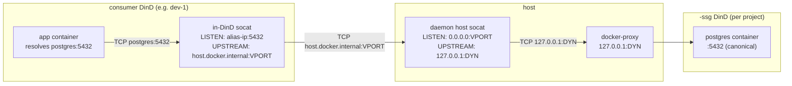

# Enrutamiento de SSG

Un Coast consumidor dentro de `<project>` resuelve `postgres:5432` al contenedor `<project>-ssg` del proyecto a través de tres capas de indirección de puertos. Esta página documenta qué es cada número de puerto, por qué existe y cómo el daemon los ensambla para que la ruta se mantenga estable entre reconstrucciones de SSG.

## Tres conceptos de puertos

| Puerto | Qué es | Estabilidad |
|---|---|---|
| **Canónico** | El puerto al que tu app realmente se conecta, por ejemplo `postgres:5432`. Idéntico a la entrada `ports = [5432]` en tu `Coastfile.shared_service_groups`. | Estable para siempre (es lo que escribiste en el Coastfile). |
| **Dinámico** | El puerto del host que publica el DinD externo del SSG, por ejemplo `127.0.0.1:54201`. Se asigna en el momento de `coast ssg run`, se libera en el momento de `coast ssg rm`. | **Cambia** cada vez que el SSG se vuelve a ejecutar. |
| **Virtual** | Un puerto del host asignado por el daemon, con alcance al proyecto (banda predeterminada `42000-43000`) al que se conectan los socats consumidor in-DinD. | Estable por `(project, service_name, container_port)`, persistido en `ssg_virtual_ports`. |

Sin puertos virtuales, cada `run` de SSG invalidaría el reenviador in-DinD de cada Coast consumidor (porque el puerto dinámico cambió). Los puertos virtuales desacoplan ambos: los consumidores apuntan a un puerto virtual estable; la capa socat del host administrada por el daemon es la única que debe actualizarse cuando cambia el puerto dinámico.

## Cadena de enrutamiento



Salto por salto:

1. La app se conecta a `postgres:5432`. `extra_hosts: postgres: <docker0 alias IP>` en el compose del consumidor resuelve la búsqueda DNS a una IP de alias asignada por el daemon en el bridge docker0.
2. El socat in-DinD del consumidor escucha en `<alias>:5432` y reenvía a `host.docker.internal:<virtual_port>`. Este reenviador se escribe **una vez en el momento del aprovisionamiento** y nunca se modifica -- como el puerto virtual es estable, no es necesario tocar el socat in-DinD en una reconstrucción de SSG.
3. `host.docker.internal` se resuelve al loopback del host dentro del DinD consumidor; el tráfico llega al host en `127.0.0.1:<virtual_port>`.
4. El socat del host administrado por el daemon escucha en `<virtual_port>` y reenvía a `127.0.0.1:<dynamic>`. Este socat **sí** se actualiza en una reconstrucción de SSG -- cuando `coast ssg run` asigna un nuevo puerto dinámico, el daemon vuelve a generar el host socat con el nuevo argumento upstream, y la configuración del lado del consumidor no tiene que cambiar.
5. `127.0.0.1:<dynamic>` es el puerto publicado del DinD externo del SSG, terminado por el docker-proxy de Docker. Desde ahí la solicitud llega al daemon docker interno de `<project>-ssg`, que la entrega al servicio postgres interno en el `:5432` canónico.

Para detalles del lado del consumidor sobre cómo se conectan los pasos 1-2 (IP de alias, `extra_hosts`, el ciclo de vida del socat in-DinD), consulta [Consuming -> How Routing Works](CONSUMING.md#how-routing-works).

## `coast ssg ports`

`coast ssg ports` muestra las tres columnas más un indicador de checkout:

```text
SERVICE              CANONICAL       DYNAMIC         VIRTUAL    STATUS
postgres             5432            54201           42000      (checked out)
redis                6379            54202           42001
```

- **`CANONICAL`** -- del Coastfile.
- **`DYNAMIC`** -- el puerto del host actualmente publicado por el contenedor SSG. Cambia en cada ejecución. Interno del daemon; los consumidores nunca lo leen.
- **`VIRTUAL`** -- el puerto estable del host a través del cual enrutan los consumidores. Persistido en `ssg_virtual_ports`.
- **`STATUS`** -- `(checked out)` cuando un socat del lado del host del puerto canónico está enlazado (consulta [Checkout](CHECKOUT.md)).

Si el SSG aún no se ha ejecutado, `VIRTUAL` es `--` (todavía no existe ninguna fila en `ssg_virtual_ports` -- el asignador se ejecuta en el momento de `coast ssg run`).

## Banda de puertos virtuales

De forma predeterminada, los puertos virtuales provienen de la banda `42000-43000`. El asignador prueba cada puerto con `TcpListener::bind` para omitir cualquier puerto actualmente en uso, y consulta la tabla persistida `ssg_virtual_ports` para evitar reutilizar un número ya asignado a otro `(project, service)`.

Puedes sobrescribir la banda mediante variables de entorno en el proceso del daemon:

```bash
COAST_VIRTUAL_PORT_BAND_START=42000
COAST_VIRTUAL_PORT_BAND_END=43000
```

Configúralas al iniciar `coastd` para ampliar, reducir o mover la banda. Los cambios solo afectan a puertos recién asignados; las asignaciones persistidas se conservan.

Cuando la banda se agota, `coast ssg run` falla con un mensaje claro y una sugerencia para ampliar la banda o eliminar proyectos no usados (`coast ssg rm --with-data` limpia las asignaciones de un proyecto).

## Persistencia y ciclo de vida

Las filas de puertos virtuales sobreviven al desgaste normal del ciclo de vida:

| Evento | `ssg_virtual_ports` |
|---|---|
| `coast ssg build` (rebuild) | conservado |
| `coast ssg stop` / `start` / `restart` | conservado |
| `coast ssg rm` | conservado |
| `coast ssg rm --with-data` | eliminado (por proyecto) |
| Reinicio del daemon | conservado (las filas son duraderas; el reconciliador vuelve a generar los host socats al iniciar) |

El reconciliador (`host_socat::reconcile_all`) se ejecuta una vez al inicio del daemon y vuelve a generar cualquier host socat que deba estar activo -- uno por `(project, service, container_port)` para cada SSG que esté actualmente `running`.

## Consumidores remotos

Un Coast remoto (creado por `coast assign --remote ...`) llega al SSG local a través de un túnel SSH inverso. Ambos lados del túnel usan el puerto **virtual**:

```
remote VM                              local host
+--------------------------+           +-----------------------------+
| consumer DinD            |           | daemon host socat           |
|  +--------------------+  |           |  LISTEN:   0.0.0.0:42000    |
|  | in-DinD socat      |  |           |  UPSTREAM: 127.0.0.1:54201  |
|  | LISTEN: alias:5432 |  |           +-----------------------------+
|  | -> hgw:42000       |  |                       ^
|  +--------------------+  |                       | (daemon socat)
|                          |                       |
|  ssh -N -R 42000:localhost:42000  <------------- |
+--------------------------+
```

- El daemon local genera `ssh -N -R <virtual_port>:localhost:<virtual_port>` contra la máquina remota.
- El sshd remoto necesita `GatewayPorts clientspecified` para que el puerto enlazado acepte tráfico desde el bridge docker (no solo desde el loopback remoto).
- Dentro del DinD remoto, `extra_hosts: postgres: host-gateway` resuelve `postgres` a la IP host-gateway del remoto. El socat in-DinD reenvía a `host-gateway:<virtual_port>`, que el túnel SSH transporta de vuelta al mismo `<virtual_port>` del host local -- donde el host socat del daemon continúa la cadena hacia el SSG.

Los túneles se consolidan por `(project, remote_host, service, container_port)` en la tabla `ssg_shared_tunnels`. Múltiples instancias consumidoras del mismo proyecto en un mismo remoto comparten **un** proceso `ssh -R`. La primera instancia que llega lo genera; las instancias posteriores lo reutilizan; la última en irse lo desmonta.

Debido a que las reconstrucciones cambian el puerto dinámico pero nunca el puerto virtual, **reconstruir el SSG localmente nunca invalida el túnel remoto**. El host socat local actualiza su upstream, y el remoto sigue conectándose al mismo número de puerto virtual.

## Ver también

- [Consuming](CONSUMING.md) -- el cableado del lado del consumidor `from_group = true` y la configuración de `extra_hosts`
- [Checkout](CHECKOUT.md) -- enlaces del host a puertos canónicos; el checkout socat apunta al mismo puerto virtual
- [Lifecycle](LIFECYCLE.md) -- cuándo se asignan los puertos virtuales, cuándo se generan los host socats, cuándo se actualizan
- [Concept: Ports](../concepts_and_terminology/PORTS.md) -- puertos canónicos vs dinámicos en el resto de Coast
- [Remote Coasts](../remote_coasts/README.md) -- la configuración más amplia de máquinas remotas en la que se integran los túneles SSH anteriores
