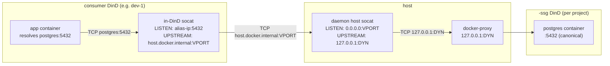

# SSG ルーティング

`<project>` 内の consumer Coast は、3 層のポート間接化を通じて `postgres:5432` をプロジェクトの `<project>-ssg` コンテナに解決します。このページでは、それぞれのポート番号が何であるか、なぜ存在するのか、そして SSG の再ビルドをまたいでも経路が安定するようにデーモンがどのようにそれらをつなぎ合わせるのかを説明します。

## 3 つのポート概念

| Port | What it is | Stability |
|---|---|---|
| **Canonical** | アプリが実際に接続するポート。例: `postgres:5432`。`Coastfile.shared_service_groups` の `ports = [5432]` エントリと同一です。 | 永続的に安定（Coastfile に書いたものそのものです）。 |
| **Dynamic** | SSG の外側 DinD が公開するホストポート。例: `127.0.0.1:54201`。`coast ssg run` 時に割り当てられ、`coast ssg rm` 時に解放されます。 | SSG を再実行するたびに**変化**します。 |
| **Virtual** | consumer in-DinD socat が接続する、デーモン割り当てのプロジェクトスコープなホストポート（デフォルト帯域 `42000-43000`）。 | `(project, service_name, container_port)` ごとに安定し、`ssg_virtual_ports` に永続化されます。 |

仮想ポートがなければ、SSG の `run` を行うたびにすべての consumer Coast の in-DinD フォワーダーが無効になります（dynamic ポートが変わるためです）。仮想ポートはこの 2 つを切り離します: consumer は安定した仮想ポートを指し、dynamic ポートが変わったときに更新が必要なのはホスト上のデーモン管理 socat レイヤーだけです。

## ルーティングチェーン



ホップごとの説明:

1. アプリは `postgres:5432` に接続します。consumer の compose にある `extra_hosts: postgres: <docker0 alias IP>` により、DNS 参照は docker0 ブリッジ上のデーモン割り当て alias IP に解決されます。
2. consumer の in-DinD socat は `<alias>:5432` で待ち受け、`host.docker.internal:<virtual_port>` に転送します。このフォワーダーは**プロビジョニング時に一度だけ**書き込まれ、その後変更されません -- 仮想ポートは安定しているため、SSG の再ビルド時に in-DinD socat を触る必要はありません。
3. `host.docker.internal` は consumer DinD 内でホストのループバックに解決されます。トラフィックはホストの `127.0.0.1:<virtual_port>` に到達します。
4. デーモン管理のホスト socat は `<virtual_port>` で待ち受け、`127.0.0.1:<dynamic>` に転送します。この socat は SSG の再ビルド時に**更新されます** -- `coast ssg run` が新しい dynamic ポートを割り当てると、デーモンは新しい upstream 引数でホスト socat を再生成し、consumer 側の設定は変更不要です。
5. `127.0.0.1:<dynamic>` は SSG 外側 DinD の公開ポートで、Docker の docker-proxy によって終端されます。そこからリクエストは inner `<project>-ssg` の docker デーモンに到達し、canonical `:5432` 上の inner postgres サービスへ配送されます。

手順 1-2 が consumer 側でどのように配線されるか（alias IP、`extra_hosts`、in-DinD socat のライフサイクル）の詳細は、[Consuming -> How Routing Works](CONSUMING.md#how-routing-works) を参照してください。

## `coast ssg ports`

`coast ssg ports` は、チェックアウトインジケーターに加えて 3 つの列すべてを表示します:

```text
SERVICE              CANONICAL       DYNAMIC         VIRTUAL    STATUS
postgres             5432            54201           42000      (checked out)
redis                6379            54202           42001
```

- **`CANONICAL`** -- Coastfile 由来です。
- **`DYNAMIC`** -- SSG コンテナが現在公開しているホストポート。実行ごとに変化します。デーモン内部用であり、consumer がこれを読むことはありません。
- **`VIRTUAL`** -- consumer が経由してルーティングする安定したホストポート。`ssg_virtual_ports` に永続化されます。
- **`STATUS`** -- ホスト側 canonical-port socat が bind されているときは `(checked out)` です（[Checkout](CHECKOUT.md) を参照）。

SSG がまだ実行されていない場合、`VIRTUAL` は `--` になります（まだ `ssg_virtual_ports` の行が存在しないためです -- アロケーターは `coast ssg run` 時に実行されます）。

## 仮想ポート帯域

デフォルトでは、仮想ポートは `42000-43000` の帯域から取得されます。アロケーターは `TcpListener::bind` で各ポートを調べて現在使用中のものをスキップし、さらに永続化された `ssg_virtual_ports` テーブルを参照して、別の `(project, service)` にすでに割り当て済みの番号の再利用を避けます。

デーモンプロセス上の環境変数でこの帯域を上書きできます:

```bash
COAST_VIRTUAL_PORT_BAND_START=42000
COAST_VIRTUAL_PORT_BAND_END=43000
```

帯域を広げたり、狭めたり、移動したりするには、`coastd` 起動時にこれらを設定してください。変更は新規に割り当てられるポートにのみ影響し、永続化済みの割り当ては保持されます。

帯域が枯渇すると、`coast ssg run` は明確なメッセージと、帯域を広げるか未使用プロジェクトを削除するヒント付きでエラーになります（`coast ssg rm --with-data` はプロジェクトの割り当てをクリアします）。

## 永続性とライフサイクル

仮想ポートの行は通常のライフサイクル変動をまたいで存続します:

| Event | `ssg_virtual_ports` |
|---|---|
| `coast ssg build` (rebuild) | 保持される |
| `coast ssg stop` / `start` / `restart` | 保持される |
| `coast ssg rm` | 保持される |
| `coast ssg rm --with-data` | 削除される（プロジェクト単位） |
| デーモン再起動 | 保持される（行は永続であり、reconciler が起動時にホスト socat を再生成します） |

reconciler（`host_socat::reconcile_all`）はデーモン起動時に一度実行され、動作しているべきホスト socat を再生成します -- 現在 `running` 状態にある各 SSG について、各 `(project, service, container_port)` ごとに 1 つです。

## リモート consumer

リモート Coast（`coast assign --remote ...` で作成）は、reverse SSH トンネルを通じてローカル SSG に到達します。トンネルの両側は **virtual** ポートを使用します:

```
remote VM                              local host
+--------------------------+           +-----------------------------+
| consumer DinD            |           | daemon host socat           |
|  +--------------------+  |           |  LISTEN:   0.0.0.0:42000    |
|  | in-DinD socat      |  |           |  UPSTREAM: 127.0.0.1:54201  |
|  | LISTEN: alias:5432 |  |           +-----------------------------+
|  | -> hgw:42000       |  |                       ^
|  +--------------------+  |                       | (daemon socat)
|                          |                       |
|  ssh -N -R 42000:localhost:42000  <------------- |
+--------------------------+
```

- ローカルデーモンは、リモートマシンに対して `ssh -N -R <virtual_port>:localhost:<virtual_port>` を起動します。
- リモート sshd では、bind されたポートが docker ブリッジからのトラフィックを受け付けるように（リモートループバックだけでなく）、`GatewayPorts clientspecified` が必要です。
- リモート DinD 内では、`extra_hosts: postgres: host-gateway` により `postgres` はリモートの host-gateway IP に解決されます。in-DinD socat は `host-gateway:<virtual_port>` に転送し、SSH トンネルがそれをローカルホストの同じ `<virtual_port>` に戻します -- そこからデーモンのホスト socat がチェーンを続けて SSG へ届けます。

トンネルは `ssg_shared_tunnels` テーブル内で `(project, remote_host, service, container_port)` ごとに統合されます。1 台のリモート上にある同一プロジェクトの複数 consumer インスタンスは、**1 つの** `ssh -R` プロセスを共有します。最初に到着したインスタンスがそれを起動し、後続インスタンスは再利用し、最後に離脱したインスタンスがそれを停止します。

再ビルドでは dynamic ポートは変わりますが virtual ポートは決して変わらないため、**ローカルで SSG を再ビルドしてもリモートトンネルは無効になりません**。ローカルホスト socat が upstream を更新し、リモート側は同じ virtual-port 番号への接続を継続します。

## 関連項目

- [Consuming](CONSUMING.md) -- consumer 側の `from_group = true` 配線と `extra_hosts` 設定
- [Checkout](CHECKOUT.md) -- canonical-port のホスト bind。checkout socat は同じ virtual ポートを対象にします
- [Lifecycle](LIFECYCLE.md) -- 仮想ポートがいつ割り当てられるか、ホスト socat がいつ起動するか、いつ更新されるか
- [Concept: Ports](../concepts_and_terminology/PORTS.md) -- Coast 全体における canonical ポートと dynamic ポート
- [Remote Coasts](../remote_coasts/README.md) -- 上記 SSH トンネルが組み込まれる、より広いリモートマシン設定
