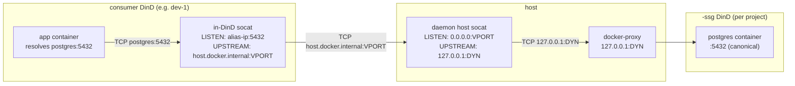

# SSG 라우팅

`<project>` 내부의 consumer Coast는 세 계층의 포트 간접 지정을 통해 `postgres:5432`를 프로젝트의 `<project>-ssg` 컨테이너로 해석합니다. 이 페이지는 각 포트 번호가 무엇인지, 왜 존재하는지, 그리고 SSG 재빌드 전반에 걸쳐 경로가 안정적으로 유지되도록 데몬이 이를 어떻게 이어 붙이는지를 설명합니다.

## 세 가지 포트 개념

| Port | 무엇인지 | 안정성 |
|---|---|---|
| **Canonical** | 앱이 실제로 연결하는 포트, 예: `postgres:5432`. `Coastfile.shared_service_groups`의 `ports = [5432]` 항목과 동일합니다. | 영구적으로 안정적임 (Coastfile에 직접 작성한 값이기 때문). |
| **Dynamic** | SSG 외부 DinD가 게시하는 호스트 포트, 예: `127.0.0.1:54201`. `coast ssg run` 시점에 할당되고, `coast ssg rm` 시점에 해제됩니다. | SSG를 다시 실행할 때마다 **변경됨**. |
| **Virtual** | consumer in-DinD socat이 연결하는, 데몬이 할당한 프로젝트 범위의 호스트 포트 (기본 대역 `42000-43000`). | `(project, service_name, container_port)`별로 안정적이며, `ssg_virtual_ports`에 영속화됨. |

가상 포트가 없다면, SSG `run`이 실행될 때마다 모든 consumer Coast의 in-DinD 포워더가 무효화됩니다(동적 포트가 바뀌기 때문입니다). 가상 포트는 이 둘을 분리합니다. consumers는 안정적인 가상 포트를 가리키고, 동적 포트가 바뀔 때 업데이트가 필요한 것은 호스트의 데몬 관리 socat 계층뿐입니다.

## 라우팅 체인



홉별 설명:

1. 앱은 `postgres:5432`로 연결합니다. consumer의 compose에 있는 `extra_hosts: postgres: <docker0 alias IP>`가 DNS 조회를 docker0 브리지 상의 데몬 할당 alias IP로 해석합니다.
2. consumer의 in-DinD socat은 `<alias>:5432`에서 수신하고 `host.docker.internal:<virtual_port>`로 전달합니다. 이 포워더는 **프로비저닝 시 한 번만 작성**되며 이후 변경되지 않습니다 -- 가상 포트는 안정적이므로, SSG 재빌드 시 in-DinD socat을 건드릴 필요가 없습니다.
3. `host.docker.internal`은 consumer DinD 내부에서 호스트의 루프백으로 해석되며, 트래픽은 호스트의 `127.0.0.1:<virtual_port>`에 도달합니다.
4. 데몬이 관리하는 호스트 socat은 `<virtual_port>`에서 수신하고 `127.0.0.1:<dynamic>`로 전달합니다. 이 socat은 SSG 재빌드 시 **업데이트됩니다** -- `coast ssg run`이 새 동적 포트를 할당하면, 데몬은 새 upstream 인자로 호스트 socat을 다시 생성하며, consumer 측 설정은 바뀔 필요가 없습니다.
5. `127.0.0.1:<dynamic>`는 SSG 외부 DinD의 게시 포트이며, Docker의 docker-proxy가 이를 종료합니다. 그 다음 요청은 내부 `<project>-ssg`의 docker daemon에 도달하고, daemon은 이를 canonical `:5432`의 내부 postgres 서비스로 전달합니다.

1-2단계가 consumer 측에서 어떻게 연결되는지(alias IP, `extra_hosts`, in-DinD socat 생명주기)에 대한 자세한 내용은 [Consuming -> How Routing Works](CONSUMING.md#how-routing-works)를 참고하세요.

## `coast ssg ports`

`coast ssg ports`는 세 개의 열과 checkout 표시기를 모두 보여줍니다:

```text
SERVICE              CANONICAL       DYNAMIC         VIRTUAL    STATUS
postgres             5432            54201           42000      (checked out)
redis                6379            54202           42001
```

- **`CANONICAL`** -- Coastfile에서 가져옵니다.
- **`DYNAMIC`** -- SSG 컨테이너가 현재 게시 중인 호스트 포트입니다. 실행마다 변경됩니다. 데몬 내부용이며, consumers는 이를 읽지 않습니다.
- **`VIRTUAL`** -- consumers가 경유하는 안정적인 호스트 포트입니다. `ssg_virtual_ports`에 영속화됩니다.
- **`STATUS`** -- 호스트 측 canonical-port socat이 바인딩되어 있을 때 `(checked out)`로 표시됩니다([Checkout](CHECKOUT.md) 참고).

SSG가 아직 실행되지 않았다면, `VIRTUAL`은 `--`입니다(`ssg_virtual_ports` 행이 아직 존재하지 않음 -- allocator는 `coast ssg run` 시점에 실행됩니다).

## 가상 포트 대역

기본적으로 가상 포트는 `42000-43000` 대역에서 가져옵니다. allocator는 현재 사용 중인 포트를 건너뛰기 위해 각 포트를 `TcpListener::bind`로 검사하고, 다른 `(project, service)`에 이미 할당된 번호를 재사용하지 않도록 영속화된 `ssg_virtual_ports` 테이블을 조회합니다.

데몬 프로세스의 env vars를 통해 이 대역을 재정의할 수 있습니다:

```bash
COAST_VIRTUAL_PORT_BAND_START=42000
COAST_VIRTUAL_PORT_BAND_END=43000
```

대역을 넓히거나, 좁히거나, 이동하려면 `coastd`를 시작할 때 이를 설정하세요. 변경 사항은 새로 할당되는 포트에만 영향을 미치며, 이미 영속화된 할당은 유지됩니다.

대역이 고갈되면 `coast ssg run`은 명확한 메시지와 함께 실패하고, 대역을 넓히거나 사용하지 않는 프로젝트를 제거하라는 힌트를 표시합니다(`coast ssg rm --with-data`는 프로젝트의 할당을 지웁니다).

## 영속성과 생명주기

가상 포트 행은 일반적인 생명주기 변화에도 유지됩니다:

| Event | `ssg_virtual_ports` |
|---|---|
| `coast ssg build` (재빌드) | 유지됨 |
| `coast ssg stop` / `start` / `restart` | 유지됨 |
| `coast ssg rm` | 유지됨 |
| `coast ssg rm --with-data` | 삭제됨 (프로젝트별) |
| 데몬 재시작 | 유지됨 (행은 영속적이며, reconciler가 시작 시 호스트 socat을 다시 생성함) |

reconciler(`host_socat::reconcile_all`)는 데몬 시작 시 한 번 실행되며, 현재 `running` 상태인 모든 SSG에 대해 각 `(project, service, container_port)`마다 살아 있어야 하는 호스트 socat을 다시 생성합니다.

## 원격 consumers

원격 Coast(`coast assign --remote ...`로 생성됨)는 reverse SSH tunnel을 통해 로컬 SSG에 도달합니다. 터널의 양쪽 모두 **가상** 포트를 사용합니다:

```
remote VM                              local host
+--------------------------+           +-----------------------------+
| consumer DinD            |           | daemon host socat           |
|  +--------------------+  |           |  LISTEN:   0.0.0.0:42000    |
|  | in-DinD socat      |  |           |  UPSTREAM: 127.0.0.1:54201  |
|  | LISTEN: alias:5432 |  |           +-----------------------------+
|  | -> hgw:42000       |  |                       ^
|  +--------------------+  |                       | (daemon socat)
|                          |                       |
|  ssh -N -R 42000:localhost:42000  <------------- |
+--------------------------+
```

- 로컬 데몬은 원격 머신을 대상으로 `ssh -N -R <virtual_port>:localhost:<virtual_port>`를 생성합니다.
- 원격 sshd는 바인딩된 포트가 원격 루프백뿐 아니라 docker bridge에서 오는 트래픽도 수용할 수 있도록 `GatewayPorts clientspecified`가 필요합니다.
- 원격 DinD 내부에서는 `extra_hosts: postgres: host-gateway`가 `postgres`를 원격의 host-gateway IP로 해석합니다. in-DinD socat은 이를 `host-gateway:<virtual_port>`로 전달하고, SSH 터널은 이를 다시 로컬 호스트의 동일한 `<virtual_port>`로 운반합니다 -- 그 지점에서 데몬의 호스트 socat이 체인을 이어 SSG까지 전달합니다.

터널은 `ssg_shared_tunnels` 테이블에서 `(project, remote_host, service, container_port)`별로 병합됩니다. 하나의 원격 호스트에서 같은 프로젝트의 여러 consumer 인스턴스는 **하나의** `ssh -R` 프로세스를 공유합니다. 먼저 도착한 인스턴스가 이를 생성하고, 이후 인스턴스는 재사용하며, 마지막 인스턴스가 떠날 때 이를 정리합니다.

재빌드로 동적 포트는 바뀌지만 가상 포트는 절대 바뀌지 않으므로, **로컬에서 SSG를 재빌드해도 원격 터널은 무효화되지 않습니다**. 로컬 호스트 socat이 upstream을 업데이트하고, 원격은 계속 같은 가상 포트 번호로 연결합니다.

## 참고

- [Consuming](CONSUMING.md) -- consumer 측 `from_group = true` 연결과 `extra_hosts` 설정
- [Checkout](CHECKOUT.md) -- canonical-port 호스트 바인딩; checkout socat은 동일한 가상 포트를 대상으로 함
- [Lifecycle](LIFECYCLE.md) -- 가상 포트가 할당되는 시점, 호스트 socat이 생성되는 시점, 갱신되는 시점
- [Concept: Ports](../concepts_and_terminology/PORTS.md) -- Coast 전반에서의 canonical 포트와 dynamic 포트
- [Remote Coasts](../remote_coasts/README.md) -- 위의 SSH 터널이 포함되는 더 넓은 원격 머신 설정
