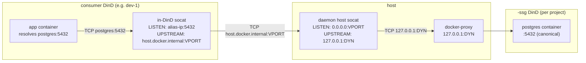

# Roteamento SSG

Um Coast consumidor dentro de `<project>` resolve `postgres:5432` para o contêiner `<project>-ssg` do projeto por meio de três camadas de indireção de porta. Esta página documenta qual é cada número de porta, por que ele existe e como o daemon os encadeia para que o caminho permaneça estável entre reconstruções do SSG.

## Três conceitos de porta

| Port | What it is | Stability |
|---|---|---|
| **Canonical** | A porta para a qual sua aplicação realmente se conecta, por exemplo, `postgres:5432`. Idêntica à entrada `ports = [5432]` em seu `Coastfile.shared_service_groups`. | Estável para sempre (é o que você escreveu no Coastfile). |
| **Dynamic** | A porta do host que o DinD externo do SSG publica, por exemplo, `127.0.0.1:54201`. Alocada no momento de `coast ssg run`, liberada no momento de `coast ssg rm`. | **Muda** toda vez que o SSG é executado novamente. |
| **Virtual** | Uma porta de host alocada pelo daemon e com escopo por projeto (faixa padrão `42000-43000`) à qual os socats in-DinD do consumidor se conectam. | Estável por `(project, service_name, container_port)`, persistida em `ssg_virtual_ports`. |

Sem portas virtuais, cada `run` do SSG invalidaria todos os encaminhadores in-DinD de todos os Coasts consumidores (porque a porta dinâmica mudou). As portas virtuais desacoplam os dois: os consumidores apontam para uma porta virtual estável; a camada socat do host gerenciada pelo daemon é a única que precisa ser atualizada quando a porta dinâmica muda.

## Cadeia de roteamento



Salto a salto:

1. A aplicação se conecta a `postgres:5432`. `extra_hosts: postgres: <docker0 alias IP>` no compose do consumidor resolve a consulta DNS para um IP de alias alocado pelo daemon na bridge docker0.
2. O socat in-DinD do consumidor escuta em `<alias>:5432` e encaminha para `host.docker.internal:<virtual_port>`. Esse encaminhador é escrito **uma vez no momento do provisionamento** e nunca é alterado -- como a porta virtual é estável, o socat in-DinD não precisa ser tocado em uma reconstrução do SSG.
3. `host.docker.internal` resolve para o loopback do host dentro do DinD do consumidor; o tráfego chega ao host em `127.0.0.1:<virtual_port>`.
4. O socat do host gerenciado pelo daemon escuta em `<virtual_port>` e encaminha para `127.0.0.1:<dynamic>`. Esse socat **é** atualizado em uma reconstrução do SSG -- quando `coast ssg run` aloca uma nova porta dinâmica, o daemon recria o socat do host com o novo argumento upstream, e a configuração do lado do consumidor não precisa mudar.
5. `127.0.0.1:<dynamic>` é a porta publicada do DinD externo do SSG, terminada pelo docker-proxy do Docker. A partir daí, a requisição atinge o daemon docker interno do `<project>-ssg`, que a entrega ao serviço postgres interno na porta canônica `:5432`.

Para detalhes do lado do consumidor sobre como as etapas 1-2 são conectadas (IP de alias, `extra_hosts`, o ciclo de vida do socat in-DinD), veja [Consuming -> How Routing Works](CONSUMING.md#how-routing-works).

## `coast ssg ports`

`coast ssg ports` mostra as três colunas mais um indicador de checkout:

```text
SERVICE              CANONICAL       DYNAMIC         VIRTUAL    STATUS
postgres             5432            54201           42000      (checked out)
redis                6379            54202           42001
```

- **`CANONICAL`** -- do Coastfile.
- **`DYNAMIC`** -- a porta do host atualmente publicada pelo contêiner SSG. Muda a cada execução. Interna ao daemon; os consumidores nunca a leem.
- **`VIRTUAL`** -- a porta estável do host pela qual os consumidores roteiam. Persistida em `ssg_virtual_ports`.
- **`STATUS`** -- `(checked out)` quando um socat do lado do host de porta canônica está vinculado (veja [Checkout](CHECKOUT.md)).

Se o SSG ainda não tiver sido executado, `VIRTUAL` será `--` (ainda não existe nenhuma linha em `ssg_virtual_ports` -- o alocador é executado no momento de `coast ssg run`).

## Faixa de portas virtuais

Por padrão, as portas virtuais vêm da faixa `42000-43000`. O alocador testa cada porta com `TcpListener::bind` para pular qualquer uma que esteja atualmente em uso e consulta a tabela persistida `ssg_virtual_ports` para evitar reutilizar um número já alocado para outro `(project, service)`.

Você pode substituir a faixa por meio de variáveis de ambiente no processo do daemon:

```bash
COAST_VIRTUAL_PORT_BAND_START=42000
COAST_VIRTUAL_PORT_BAND_END=43000
```

Defina-as ao iniciar `coastd` para ampliar, reduzir ou mover a faixa. As mudanças afetam apenas portas recém-alocadas; as alocações persistidas são preservadas.

Quando a faixa se esgota, `coast ssg run` falha com uma mensagem clara e uma dica para ampliar a faixa ou remover projetos não utilizados (`coast ssg rm --with-data` limpa as alocações de um projeto).

## Persistência e ciclo de vida

As linhas de portas virtuais sobrevivem ao churn normal do ciclo de vida:

| Event | `ssg_virtual_ports` |
|---|---|
| `coast ssg build` (rebuild) | preservado |
| `coast ssg stop` / `start` / `restart` | preservado |
| `coast ssg rm` | preservado |
| `coast ssg rm --with-data` | removido (por projeto) |
| Reinício do daemon | preservado (as linhas são duráveis; o reconciliador recria os socats do host na inicialização) |

O reconciliador (`host_socat::reconcile_all`) é executado uma vez na inicialização do daemon e recria qualquer socat do host que deva estar ativo -- um por `(project, service, container_port)` para cada SSG que esteja atualmente `running`.

## Consumidores remotos

Um Coast remoto (criado por `coast assign --remote ...`) alcança o SSG local por meio de um túnel SSH reverso. Ambos os lados do túnel usam a porta **virtual**:

```
remote VM                              local host
+--------------------------+           +-----------------------------+
| consumer DinD            |           | daemon host socat           |
|  +--------------------+  |           |  LISTEN:   0.0.0.0:42000    |
|  | in-DinD socat      |  |           |  UPSTREAM: 127.0.0.1:54201  |
|  | LISTEN: alias:5432 |  |           +-----------------------------+
|  | -> hgw:42000       |  |                       ^
|  +--------------------+  |                       | (daemon socat)
|                          |                       |
|  ssh -N -R 42000:localhost:42000  <------------- |
+--------------------------+
```

- O daemon local inicia `ssh -N -R <virtual_port>:localhost:<virtual_port>` contra a máquina remota.
- O sshd remoto precisa de `GatewayPorts clientspecified` para que a porta vinculada aceite tráfego da bridge docker (não apenas do loopback remoto).
- Dentro do DinD remoto, `extra_hosts: postgres: host-gateway` resolve `postgres` para o IP host-gateway do remoto. O socat in-DinD encaminha para `host-gateway:<virtual_port>`, que o túnel SSH transporta de volta para a mesma `<virtual_port>` do host local -- onde o socat do host do daemon continua a cadeia até o SSG.

Os túneis são coalescidos por `(project, remote_host, service, container_port)` na tabela `ssg_shared_tunnels`. Múltiplas instâncias consumidoras do mesmo projeto em um único remoto compartilham **um** processo `ssh -R`. A primeira instância a chegar o inicia; as instâncias subsequentes o reutilizam; a última instância a sair o encerra.

Como as reconstruções mudam a porta dinâmica, mas nunca a porta virtual, **reconstruir o SSG localmente nunca invalida o túnel remoto**. O socat do host local atualiza seu upstream, e o remoto continua se conectando ao mesmo número de porta virtual.

## Veja também

- [Consuming](CONSUMING.md) -- a configuração do lado do consumidor de `from_group = true` e `extra_hosts`
- [Checkout](CHECKOUT.md) -- bindings de host de porta canônica; o socat de checkout aponta para a mesma porta virtual
- [Lifecycle](LIFECYCLE.md) -- quando as portas virtuais são alocadas, quando os socats do host são iniciados, quando são atualizados
- [Concept: Ports](../concepts_and_terminology/PORTS.md) -- portas canônicas vs dinâmicas no restante do Coast
- [Remote Coasts](../remote_coasts/README.md) -- a configuração mais ampla de máquina remota na qual os túneis SSH acima se encaixam
