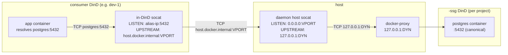

# Маршрутизация SSG

Потребляющий Coast внутри `<project>` разрешает `postgres:5432` в контейнер `<project>-ssg` проекта через три уровня косвенной адресации портов. На этой странице описано, что означает каждый номер порта, зачем он существует и как демон связывает их вместе, чтобы путь оставался стабильным при пересборках SSG.

## Три концепции портов

| Port | Что это | Стабильность |
|---|---|---|
| **Canonical** | Порт, к которому ваше приложение фактически подключается, например `postgres:5432`. Идентичен записи `ports = [5432]` в вашем `Coastfile.shared_service_groups`. | Стабилен навсегда (это то, что вы указали в Coastfile). |
| **Dynamic** | Порт хоста, который публикует внешний DinD SSG, например `127.0.0.1:54201`. Выделяется во время `coast ssg run`, освобождается во время `coast ssg rm`. | **Меняется** каждый раз при повторном запуске SSG. |
| **Virtual** | Выделяемый демоном, привязанный к проекту порт хоста (по умолчанию диапазон `42000-43000`), к которому подключаются consumer in-DinD socat. | Стабилен для `(project, service_name, container_port)`, сохраняется в `ssg_virtual_ports`. |

Без виртуальных портов каждый `run` SSG делал бы недействительным каждый in-DinD forwarder потребляющего Coast (потому что dynamic port смещался). Виртуальные порты разделяют эти вещи: consumers указывают на стабильный virtual port; только управляемому демоном слою socat на хосте нужно обновляться, когда меняется dynamic port.

## Цепочка маршрутизации



Переход за переходом:

1. Приложение подключается к `postgres:5432`. `extra_hosts: postgres: <docker0 alias IP>` в compose consumer-а разрешает DNS-запрос в выделенный демоном alias IP на мосту docker0.
2. in-DinD socat consumer-а слушает на `<alias>:5432` и перенаправляет на `host.docker.internal:<virtual_port>`. Этот forwarder записывается **один раз во время provision** и никогда не изменяется -- поскольку virtual port стабилен, in-DinD socat не нужно трогать при пересборке SSG.
3. `host.docker.internal` внутри consumer DinD разрешается в loopback хоста; трафик попадает на хост по адресу `127.0.0.1:<virtual_port>`.
4. Управляемый демоном host socat слушает на `<virtual_port>` и перенаправляет на `127.0.0.1:<dynamic>`. Этот socat **обновляется** при пересборке SSG -- когда `coast ssg run` выделяет новый dynamic port, демон перезапускает host socat с новым аргументом upstream, и конфигурацию на стороне consumer-а менять не нужно.
5. `127.0.0.1:<dynamic>` — это опубликованный порт внешнего DinD SSG, завершаемый `docker-proxy` Docker. Оттуда запрос попадает к docker daemon внутреннего `<project>-ssg`, который доставляет его внутреннему сервису postgres на canonical `:5432`.

Подробности со стороны consumer-а о том, как устроены шаги 1-2 (alias IP, `extra_hosts`, жизненный цикл in-DinD socat), см. в [Consuming -> How Routing Works](CONSUMING.md#how-routing-works).

## `coast ssg ports`

`coast ssg ports` показывает все три колонки плюс индикатор checkout:

```text
SERVICE              CANONICAL       DYNAMIC         VIRTUAL    STATUS
postgres             5432            54201           42000      (checked out)
redis                6379            54202           42001
```

- **`CANONICAL`** -- из Coastfile.
- **`DYNAMIC`** -- текущий опубликованный на хосте порт контейнера SSG. Меняется при каждом запуске. Внутренний для демона; consumers его никогда не читают.
- **`VIRTUAL`** -- стабильный порт хоста, через который маршрутизируются consumers. Сохраняется в `ssg_virtual_ports`.
- **`STATUS`** -- `(checked out)`, когда привязан host-side socat canonical-port (см. [Checkout](CHECKOUT.md)).

Если SSG ещё не запускался, `VIRTUAL` будет `--` (строка в `ssg_virtual_ports` ещё не существует -- allocator запускается во время `coast ssg run`).

## Диапазон виртуальных портов

По умолчанию виртуальные порты берутся из диапазона `42000-43000`. Allocator проверяет каждый порт с помощью `TcpListener::bind`, чтобы пропустить всё, что уже используется, и сверяется с сохранённой таблицей `ssg_virtual_ports`, чтобы не переиспользовать номер, уже выделенный другому `(project, service)`.

Вы можете переопределить диапазон через переменные окружения процесса демона:

```bash
COAST_VIRTUAL_PORT_BAND_START=42000
COAST_VIRTUAL_PORT_BAND_END=43000
```

Установите их при запуске `coastd`, чтобы расширить, сузить или сместить диапазон. Изменения влияют только на вновь выделяемые порты; сохранённые выделения сохраняются.

Когда диапазон исчерпан, `coast ssg run` завершается с понятным сообщением и подсказкой расширить диапазон или удалить неиспользуемые проекты (`coast ssg rm --with-data` очищает выделения проекта).

## Хранение и жизненный цикл

Строки virtual-port переживают обычные изменения жизненного цикла:

| Event | `ssg_virtual_ports` |
|---|---|
| `coast ssg build` (rebuild) | сохраняется |
| `coast ssg stop` / `start` / `restart` | сохраняется |
| `coast ssg rm` | сохраняется |
| `coast ssg rm --with-data` | удаляется (для проекта) |
| Перезапуск демона | сохраняется (строки долговечны; reconciler заново запускает host socat при старте) |

Reconciler (`host_socat::reconcile_all`) запускается один раз при старте демона и заново запускает любой host socat, который должен быть активен -- по одному на `(project, service, container_port)` для каждого SSG, который сейчас находится в состоянии `running`.

## Удалённые consumers

Удалённый Coast (созданный через `coast assign --remote ...`) достигает локального SSG через обратный SSH-туннель. Обе стороны туннеля используют **virtual** port:

```
remote VM                              local host
+--------------------------+           +-----------------------------+
| consumer DinD            |           | daemon host socat           |
|  +--------------------+  |           |  LISTEN:   0.0.0.0:42000    |
|  | in-DinD socat      |  |           |  UPSTREAM: 127.0.0.1:54201  |
|  | LISTEN: alias:5432 |  |           +-----------------------------+
|  | -> hgw:42000       |  |                       ^
|  +--------------------+  |                       | (daemon socat)
|                          |                       |
|  ssh -N -R 42000:localhost:42000  <------------- |
+--------------------------+
```

- Локальный демон запускает `ssh -N -R <virtual_port>:localhost:<virtual_port>` к удалённой машине.
- На удалённом `sshd` требуется `GatewayPorts clientspecified`, чтобы привязанный порт принимал трафик с docker bridge (а не только с loopback удалённой машины).
- Внутри удалённого DinD `extra_hosts: postgres: host-gateway` разрешает `postgres` в IP `host-gateway` удалённой машины. in-DinD socat перенаправляет на `host-gateway:<virtual_port>`, что SSH-туннель передаёт обратно на тот же `<virtual_port>` локального хоста -- где host socat демона продолжает цепочку до SSG.

Туннели объединяются для `(project, remote_host, service, container_port)` в таблице `ssg_shared_tunnels`. Несколько экземпляров consumer одного и того же проекта на одном удалённом хосте используют **один** процесс `ssh -R`. Первый пришедший экземпляр запускает его; последующие экземпляры переиспользуют его; последний уходящий экземпляр завершает его.

Поскольку при пересборках меняется dynamic port, но никогда не меняется virtual port, **локальная пересборка SSG никогда не делает удалённый туннель недействительным**. Локальный host socat обновляет свой upstream, а удалённая сторона продолжает подключаться к тому же номеру virtual port.

## См. также

- [Consuming](CONSUMING.md) -- wiring `from_group = true` на стороне consumer-а и настройка `extra_hosts`
- [Checkout](CHECKOUT.md) -- host bindings canonical-port; checkout socat нацелен на тот же virtual port
- [Lifecycle](LIFECYCLE.md) -- когда выделяются virtual ports, когда запускаются host socat, когда они обновляются
- [Concept: Ports](../concepts_and_terminology/PORTS.md) -- canonical и dynamic порты в остальной части Coast
- [Remote Coasts](../remote_coasts/README.md) -- более широкая настройка удалённых машин, в которую встраиваются описанные выше SSH-туннели
