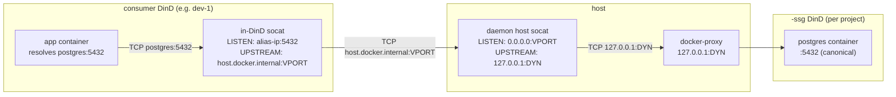

# SSG Routing

A consumer Coast inside `<project>` resolves `postgres:5432` to the project's `<project>-ssg` container through three layers of port indirection. This page documents what each port number is, why it exists, and how the daemon stitches them together so the path stays stable across SSG rebuilds.

## Three port concepts

| Port | What it is | Stability |
|---|---|---|
| **Canonical** | The port your app actually dials, e.g. `postgres:5432`. Identical to the `ports = [5432]` entry in your `Coastfile.shared_service_groups`. | Stable forever (it's what you wrote in the Coastfile). |
| **Dynamic** | The host port the SSG outer DinD publishes, e.g. `127.0.0.1:54201`. Allocated at `coast ssg run` time, freed at `coast ssg rm` time. | **Changes** every time the SSG is re-run. |
| **Virtual** | A daemon-allocated, project-scoped host port (default band `42000-43000`) that consumer in-DinD socats connect to. | Stable per `(project, service_name, container_port)`, persisted in `ssg_virtual_ports`. |

Without virtual ports, every SSG `run` would invalidate every consumer Coast's in-DinD forwarder (because the dynamic port shifted). Virtual ports decouple the two: consumers point at a stable virtual port; the host's daemon-managed socat layer is the only thing that has to update when the dynamic port changes.

## Routing chain



Hop by hop:

1. The app dials `postgres:5432`. `extra_hosts: postgres: <docker0 alias IP>` in the consumer's compose resolves the DNS lookup to a daemon-allocated alias IP on the docker0 bridge.
2. The consumer's in-DinD socat listens on `<alias>:5432` and forwards to `host.docker.internal:<virtual_port>`. This forwarder is written **once at provision time** and never mutated -- because the virtual port is stable, the in-DinD socat doesn't need to be touched on SSG rebuild.
3. `host.docker.internal` resolves to the host's loopback inside the consumer DinD; the traffic lands on the host at `127.0.0.1:<virtual_port>`.
4. The daemon-managed host socat listens on `<virtual_port>` and forwards to `127.0.0.1:<dynamic>`. This socat **is** updated on SSG rebuild -- when `coast ssg run` allocates a new dynamic port, the daemon respawns the host socat with the new upstream argument, and consumer-side configuration doesn't have to change.
5. `127.0.0.1:<dynamic>` is the SSG outer DinD's published port, terminated by Docker's docker-proxy. From there the request hits the inner `<project>-ssg`'s docker daemon, which delivers it to the inner postgres service on canonical `:5432`.

For consumer-side details on how steps 1-2 are wired (alias IP, `extra_hosts`, the in-DinD socat lifecycle), see [Consuming -> How Routing Works](CONSUMING.md#how-routing-works).

## `coast ssg ports`

`coast ssg ports` shows all three columns plus a checkout indicator:

```text
SERVICE              CANONICAL       DYNAMIC         VIRTUAL    STATUS
postgres             5432            54201           42000      (checked out)
redis                6379            54202           42001
```

- **`CANONICAL`** -- from the Coastfile.
- **`DYNAMIC`** -- the SSG container's currently-published host port. Changes per run. Daemon-internal; consumers never read it.
- **`VIRTUAL`** -- the stable host port consumers route through. Persisted in `ssg_virtual_ports`.
- **`STATUS`** -- `(checked out)` when a host-side canonical-port socat is bound (see [Checkout](CHECKOUT.md)).

If the SSG hasn't run yet, `VIRTUAL` is `--` (no `ssg_virtual_ports` row exists yet -- the allocator runs at `coast ssg run` time).

## Virtual-port band

By default, virtual ports come from the `42000-43000` band. The allocator probes each port with `TcpListener::bind` to skip anything currently in use, and consults the persisted `ssg_virtual_ports` table to avoid reusing a number already allocated to another `(project, service)`.

You can override the band via env vars on the daemon process:

```bash
COAST_VIRTUAL_PORT_BAND_START=42000
COAST_VIRTUAL_PORT_BAND_END=43000
```

Set them when launching `coastd` to widen, narrow, or move the band. Changes only affect newly-allocated ports; persisted allocations are preserved.

When the band is exhausted, `coast ssg run` errors out with a clear message and a hint to widen the band or remove unused projects (`coast ssg rm --with-data` clears a project's allocations).

## Persistence and lifecycle

Virtual-port rows survive normal lifecycle churn:

| Event | `ssg_virtual_ports` |
|---|---|
| `coast ssg build` (rebuild) | preserved |
| `coast ssg stop` / `start` / `restart` | preserved |
| `coast ssg rm` | preserved |
| `coast ssg rm --with-data` | dropped (per-project) |
| Daemon restart | preserved (rows are durable; reconciler re-spawns host socats on startup) |

The reconciler (`host_socat::reconcile_all`) runs once at daemon start and respawns any host socat that should be alive -- one per `(project, service, container_port)` for every SSG that's currently `running`.

## Remote consumers

A remote Coast (created by `coast assign --remote ...`) reaches the local SSG through a reverse SSH tunnel. Both sides of the tunnel use the **virtual** port:

```
remote VM                              local host
+--------------------------+           +-----------------------------+
| consumer DinD            |           | daemon host socat           |
|  +--------------------+  |           |  LISTEN:   0.0.0.0:42000    |
|  | in-DinD socat      |  |           |  UPSTREAM: 127.0.0.1:54201  |
|  | LISTEN: alias:5432 |  |           +-----------------------------+
|  | -> hgw:42000       |  |                       ^
|  +--------------------+  |                       | (daemon socat)
|                          |                       |
|  ssh -N -R 42000:localhost:42000  <------------- |
+--------------------------+
```

- The local daemon spawns `ssh -N -R <virtual_port>:localhost:<virtual_port>` against the remote machine.
- The remote sshd needs `GatewayPorts clientspecified` so the bound port accepts traffic from the docker bridge (not just remote loopback).
- Inside the remote DinD, `extra_hosts: postgres: host-gateway` resolves `postgres` to the remote's host-gateway IP. The in-DinD socat forwards to `host-gateway:<virtual_port>`, which the SSH tunnel carries back to the local host's same `<virtual_port>` -- where the daemon's host socat continues the chain to the SSG.

Tunnels are coalesced per `(project, remote_host, service, container_port)` in the `ssg_shared_tunnels` table. Multiple consumer instances of the same project on one remote share **one** `ssh -R` process. The first-arriving instance spawns it; subsequent instances reuse it; the last-departing instance tears it down.

Because rebuilds change the dynamic port but never the virtual port, **rebuilding the SSG locally never invalidates the remote tunnel**. The local host socat updates its upstream, and the remote keeps connecting to the same virtual-port number.

## See Also

- [Consuming](CONSUMING.md) -- the consumer-side `from_group = true` wiring and `extra_hosts` setup
- [Checkout](CHECKOUT.md) -- canonical-port host bindings; the checkout socat targets the same virtual port
- [Lifecycle](LIFECYCLE.md) -- when virtual ports are allocated, when host socats spawn, when they get refreshed
- [Concept: Ports](../concepts_and_terminology/PORTS.md) -- canonical vs dynamic ports across the rest of Coast
- [Remote Coasts](../remote_coasts/README.md) -- the broader remote-machine setup that the SSH tunnels above slot into
