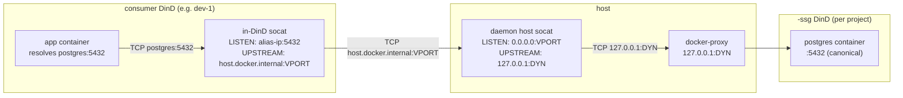

# SSG 路由

`<project>` 内的一个 consumer Coast 通过三层端口间接映射，将 `postgres:5432` 解析到该项目的 `<project>-ssg` 容器。本文档说明了每个端口号是什么、为什么存在，以及守护进程如何将它们串联起来，从而使该路径在 SSG 重建后仍保持稳定。

## 三种端口概念

| Port | 它是什么 | 稳定性 |
|---|---|---|
| **Canonical** | 你的应用实际连接的端口，例如 `postgres:5432`。与 `Coastfile.shared_service_groups` 中的 `ports = [5432]` 条目一致。 | 永久稳定（这是你在 Coastfile 中写下的内容）。 |
| **Dynamic** | SSG 外层 DinD 发布到宿主机的端口，例如 `127.0.0.1:54201`。在 `coast ssg run` 时分配，在 `coast ssg rm` 时释放。 | 每次重新运行 SSG 时都会**变化**。 |
| **Virtual** | 由守护进程分配的、按项目作用域划分的宿主机端口（默认范围 `42000-43000`），供 consumer in-DinD socat 连接。 | 对每个 `(project, service_name, container_port)` 保持稳定，持久化在 `ssg_virtual_ports` 中。 |

如果没有 virtual port，每次 SSG `run` 都会使每个 consumer Coast 的 in-DinD 转发器失效（因为 dynamic port 变了）。Virtual port 将两者解耦:consumer 指向一个稳定的 virtual port；当 dynamic port 变化时，只有宿主机上由守护进程管理的 socat 层需要更新。

## 路由链路



逐跳说明:

1. 应用连接 `postgres:5432`。consumer 的 compose 中的 `extra_hosts: postgres: <docker0 alias IP>` 将 DNS 查询解析到 docker0 网桥上由守护进程分配的一个别名 IP。
2. consumer 的 in-DinD socat 监听 `<alias>:5432`，并转发到 `host.docker.internal:<virtual_port>`。这个转发器在**provision 时只写入一次**，之后永不修改——因为 virtual port 是稳定的，所以 SSG 重建时不需要触碰 in-DinD socat。
3. 在 consumer DinD 内部，`host.docker.internal` 解析为宿主机的回环地址；流量会到达宿主机的 `127.0.0.1:<virtual_port>`。
4. 由守护进程管理的宿主机 socat 监听 `<virtual_port>`，并转发到 `127.0.0.1:<dynamic>`。这个 socat 在 SSG 重建时**会**更新——当 `coast ssg run` 分配了新的 dynamic port 时，守护进程会使用新的上游参数重新拉起宿主机 socat，而 consumer 侧配置无需改变。
5. `127.0.0.1:<dynamic>` 是 SSG 外层 DinD 发布到宿主机的端口，由 Docker 的 docker-proxy 终止。从这里开始，请求会命中内层 `<project>-ssg` 的 docker 守护进程，再由它将请求投递给监听 canonical `:5432` 的内部 postgres 服务。

关于 consumer 侧步骤 1-2 的具体连线方式（alias IP、`extra_hosts`、in-DinD socat 生命周期），请参见 [Consuming -> How Routing Works](CONSUMING.md#how-routing-works)。

## `coast ssg ports`

`coast ssg ports` 会显示这三列以及一个 checkout 指示器:

```text
SERVICE              CANONICAL       DYNAMIC         VIRTUAL    STATUS
postgres             5432            54201           42000      (checked out)
redis                6379            54202           42001
```

- **`CANONICAL`** -- 来自 Coastfile。
- **`DYNAMIC`** -- SSG 容器当前发布到宿主机的端口。每次运行都可能变化。守护进程内部使用；consumer 永远不会读取它。
- **`VIRTUAL`** -- consumer 进行路由时经过的稳定宿主机端口。持久化在 `ssg_virtual_ports` 中。
- **`STATUS`** -- 当宿主机侧的 canonical-port socat 已绑定时，显示 `(checked out)`（见 [Checkout](CHECKOUT.md)）。

如果 SSG 还没有运行过，`VIRTUAL` 会显示为 `--`（因为此时还不存在 `ssg_virtual_ports` 行——分配器在 `coast ssg run` 时运行）。

## Virtual-port 范围

默认情况下，virtual port 来自 `42000-43000` 范围。分配器会使用 `TcpListener::bind` 探测每个端口，以跳过当前已被占用的端口，并查询持久化的 `ssg_virtual_ports` 表，以避免复用已经分配给其他 `(project, service)` 的号码。

你可以通过守护进程的环境变量覆盖此范围:

```bash
COAST_VIRTUAL_PORT_BAND_START=42000
COAST_VIRTUAL_PORT_BAND_END=43000
```

在启动 `coastd` 时设置它们，以扩大、缩小或移动该范围。变更只影响新分配的端口；已持久化的分配会被保留。

当该范围耗尽时，`coast ssg run` 会报错，并给出清晰的提示，建议你扩大范围或移除未使用的项目（`coast ssg rm --with-data` 会清除某个项目的分配记录）。

## 持久化与生命周期

Virtual-port 记录会在正常的生命周期变动中保留:

| Event | `ssg_virtual_ports` |
|---|---|
| `coast ssg build`（重建） | 保留 |
| `coast ssg stop` / `start` / `restart` | 保留 |
| `coast ssg rm` | 保留 |
| `coast ssg rm --with-data` | 删除（按项目） |
| 守护进程重启 | 保留（记录是持久化的；reconciler 会在启动时重新拉起宿主机 socat） |

reconciler（`host_socat::reconcile_all`）会在守护进程启动时运行一次，并重新拉起所有本应存活的宿主机 socat——对于每个当前处于 `running` 状态的 SSG，会为每个 `(project, service, container_port)` 启动一个。

## 远程 consumer

远程 Coast（通过 `coast assign --remote ...` 创建）通过反向 SSH 隧道访问本地 SSG。隧道两端都使用 **virtual** port:

```
remote VM                              local host
+--------------------------+           +-----------------------------+
| consumer DinD            |           | daemon host socat           |
|  +--------------------+  |           |  LISTEN:   0.0.0.0:42000    |
|  | in-DinD socat      |  |           |  UPSTREAM: 127.0.0.1:54201  |
|  | LISTEN: alias:5432 |  |           +-----------------------------+
|  | -> hgw:42000       |  |                       ^
|  +--------------------+  |                       | (daemon socat)
|                          |                       |
|  ssh -N -R 42000:localhost:42000  <------------- |
+--------------------------+
```

- 本地守护进程会针对远程机器启动 `ssh -N -R <virtual_port>:localhost:<virtual_port>`。
- 远程 sshd 需要启用 `GatewayPorts clientspecified`，这样绑定的端口才能接受来自 docker 网桥的流量（而不只是远程回环地址）。
- 在远程 DinD 内部，`extra_hosts: postgres: host-gateway` 会将 `postgres` 解析为远程机器的 host-gateway IP。in-DinD socat 将流量转发到 `host-gateway:<virtual_port>`，SSH 隧道再把它带回本地主机上的同一个 `<virtual_port>`——在这里，守护进程的宿主机 socat 继续将链路转发到 SSG。

隧道会在 `ssg_shared_tunnels` 表中按 `(project, remote_host, service, container_port)` 合并。同一远程机器上、同一项目的多个 consumer 实例会共享**一个** `ssh -R` 进程。第一个到达的实例启动它；后续实例复用它；最后一个离开的实例将其关闭。

因为重建会改变 dynamic port，但不会改变 virtual port，所以**在本地重建 SSG 永远不会使远程隧道失效**。本地主机 socat 会更新其上游，而远程端仍继续连接同一个 virtual-port 号码。

## See Also

- [Consuming](CONSUMING.md) -- consumer 侧的 `from_group = true` 连线方式和 `extra_hosts` 设置
- [Checkout](CHECKOUT.md) -- canonical-port 宿主机绑定；checkout socat 指向同一个 virtual port
- [Lifecycle](LIFECYCLE.md) -- virtual port 在何时分配、宿主机 socat 在何时启动、何时刷新
- [Concept: Ports](../concepts_and_terminology/PORTS.md) -- Coast 其余部分中的 canonical 与 dynamic port
- [Remote Coasts](../remote_coasts/README.md) -- 上述 SSH 隧道所嵌入的更广义远程机器配置
